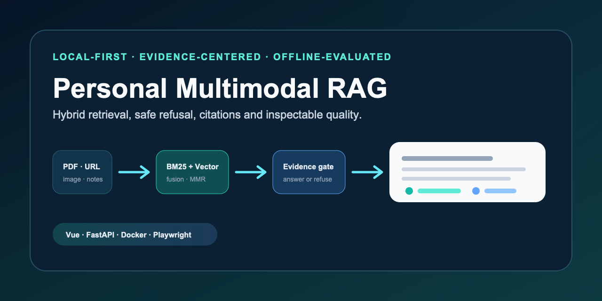
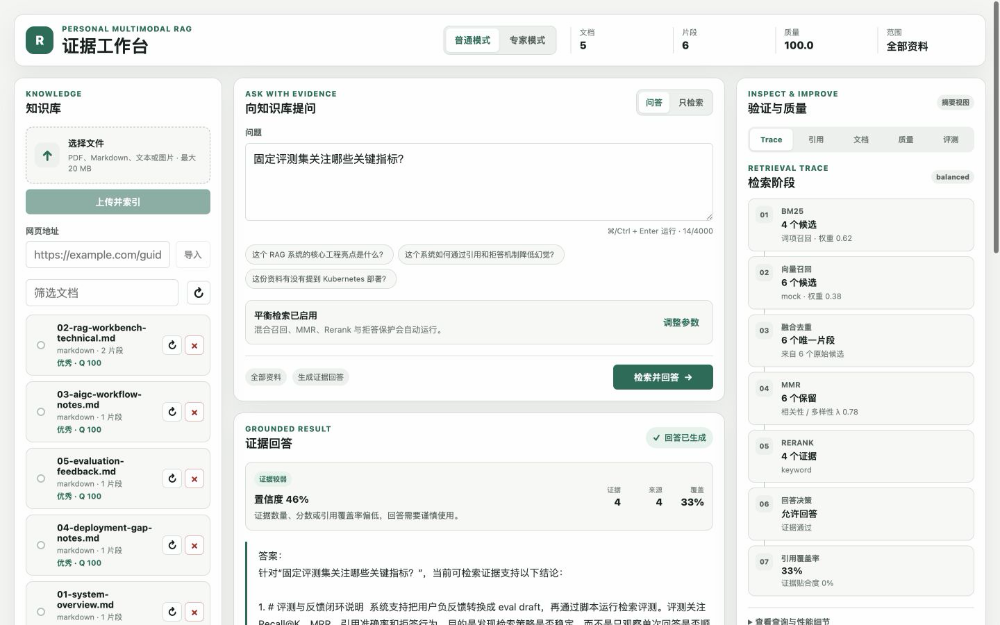
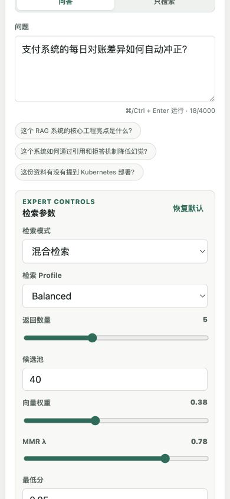

# Personal Multimodal RAG · Evidence Workbench

[中文说明](README.md) · **English**

[](https://github.com/728792899-create/personal-multimodal-rag/actions/workflows/ci.yml)
[](LICENSE)
[](.env.example)



**A local-first multimodal RAG workbench where retrieval, refusal and citation quality stay inspectable.**

[Quick start](#zero-key-quick-start) · [Case study](docs/case-study.md) · [Architecture](docs/architecture.md) · [Evaluation](docs/evaluation-results.md) · [Security](docs/security-model.md) · [Full documentation](docs/README.md)

The project is a durable single-instance Beta rather than a chat UI wrapped around one model call. It ingests PDF, DOCX, Markdown, text, images and public URLs into isolated knowledge bases; combines BM25 and vector recall; persists conversations; streams audited answers; refuses unsupported questions; and links every answer back to inspectable chunks.

The in-progress **0.3 Multimodal Intelligence** release adds a typed text/heading/image/table/equation/code intermediate representation, content-addressed assets, contextual enrichment, and a provenance-backed Graph-lite. Graph paths only navigate to local evidence chunks before RRF, MMR, reranking, refusal, and citation audit. The zero-download built-in parser and deterministic template enrichment remain the default; heavy parsers and vision providers are optional. See the [pinned RAG-Anything comparative review](docs/comparative-review-rag-anything.md) for the evidence and trade-offs.

The default path is deterministic and offline: hash embeddings, an in-memory vector store and template answers require **no API key and make no paid API calls**. Optional adapters expose the production integration boundaries without making the local demo depend on them.

## What reviewers can verify

| Product behavior | Trust mechanism | Engineering evidence |
| --- | --- | --- |
| File upload and guarded URL import | Evidence threshold and explicit refusal | FastAPI, Vue 3, Docker Compose |
| Ordinary and expert modes | Stage-by-stage retrieval Trace | pytest, Vitest and Playwright |
| Citation and neighboring context | Citation coverage audit | Fixed 40-case offline golden set |
| Feedback to evaluation draft | Request IDs, timeout, cancel and retry | Health checks and five-job CI |
| Durable local index jobs | Lease recovery and index compatibility | 97 backend / 13 frontend / 6 E2E tests |


## Interface

| Workbench | Grounded answer | Mobile refusal |
| --- | --- | --- |
|  |  |  |

The extended gallery also shows [URL ingestion](docs/screenshots/04-ingestion-url.png), [neighboring citation context](docs/screenshots/05-citation-context.png), [quality audit](docs/screenshots/06-quality-dashboard.png), [feedback-generated eval drafts](docs/screenshots/07-feedback-eval-draft.png), and [retry after an API failure](docs/screenshots/08-error-retry.png).

## Zero-key quick start

Requirements: Python 3.11+ and Node.js 22+.

```bash
git clone https://github.com/728792899-create/personal-multimodal-rag.git
cd personal-multimodal-rag

python3 -m venv .venv
source .venv/bin/activate
python -m pip install -r backend/requirements.txt
npm ci
npm --prefix frontend ci
cp .env.example .env
npm run dev
```

In another terminal, load the repository's sanitized fixtures:

```bash
source .venv/bin/activate
npm run demo:bootstrap
```

Open [http://127.0.0.1:5173](http://127.0.0.1:5173). The default environment uses:

```text
EMBEDDING_PROVIDER=mock
VECTOR_STORE=memory
ANSWER_PROVIDER=template
QUERY_REWRITE_PROVIDER=none
```

The Docker path is equally self-contained:

```bash
docker compose up --build --wait -d
npm run demo:bootstrap
```

## Architecture and request lifecycle


The Vue application is split into a page, domain components, the `useWorkbench` composable, and API modules. FastAPI keeps a stable composition root while document, retrieval and quality routes live in separate domain routers. The service layer owns ingestion, retrieval, answer generation and citation audit; provider adapters retain offline fallbacks.

Read the [architecture guide](docs/architecture.md), [code tour](docs/code-tour.md), [SQLite data model](docs/data-model.md), and [API reference](docs/api-reference.md) for implementation-level detail.

## Deterministic evaluation


| Metric | Recorded result | CI minimum |
| --- | ---: | ---: |
| Recall@5 | 1.0000 | 0.90 |
| MRR | 0.9844 | 0.75 |
| First-citation accuracy | 0.9688 | 0.75 |
| Refusal accuracy | 1.0000 | 0.80 |
| Answer-acceptance accuracy | 1.0000 | 0.85 |

The set contains 40 sanitized cases: 32 answerable and 8 refusal cases, including knowledge-base isolation, multi-turn follow-ups and real DOCX table parsing. These numbers are regression signals for fixed repository fixtures—not a claim about open-domain production quality. See [evaluation results and caveats](docs/evaluation-results.md).

Run all acceptance checks with offline providers enforced:

```bash
npm run verify
```

Or run `npm test`, `npm run lint:docs`, `npm run lint:secrets`, `npm run build`, `npm run test:demo`, `npm run eval:retrieval`, and `npm run test:e2e` separately.

## Security and production boundary


Implemented controls cover upload type/size/signature checks, SSRF-aware URL validation across redirects, optional bearer authentication, process-local rate limiting, timeouts, cancellation, source cleanup, request IDs and sensitive-log redaction. The default Sentry integration disables PII and request bodies.

This repository does **not** claim multi-tenant isolation. Versioned SQLite migrations, a lease-based local worker, local uploads, memory vectors and process-local rate limiting fit the local/single-instance Beta. Production teams still need workspace-scoped authorization, a distributed queue, object storage, pgvector migrations, Redis-backed limits, malware scanning, backups and operational ownership. The boundary and migration steps are explicit in the [Durable Local 0.2 guide](docs/durable-local-0.2.md), [security model](docs/security-model.md), and [production adapter plan](docs/production-adapters.md).

## License

[MIT](LICENSE). For contributions and responsible disclosure, see [CONTRIBUTING.md](CONTRIBUTING.md) and [SECURITY.md](SECURITY.md).
