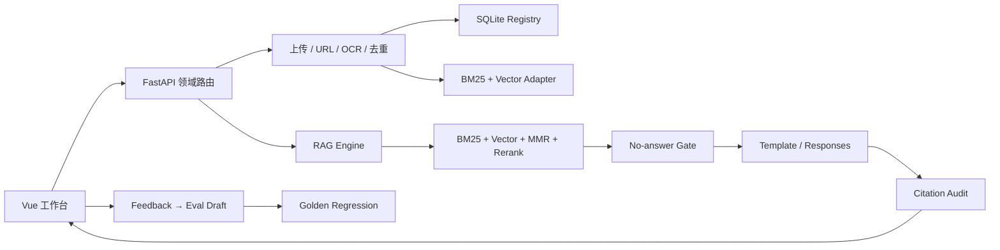

# Personal Multimodal RAG · 证据工作台

[](https://github.com/728792899-create/personal-multimodal-rag/actions/workflows/ci.yml)
[](LICENSE)

面向单用户/小团队 Beta 的本地优先多模态 RAG 工作台。它不只展示“上传并问答”，还把 BM25、向量召回、融合去重、MMR、Rerank、拒答决策和引用覆盖率组织成可理解、可回归的证据链。

默认使用 deterministic hash embedding、内存向量库和模板回答：**无需真实 API Key、不会调用付费 API**。PDF、Markdown、文本、图片 OCR、URL 导入、引用上下文、质量审计、反馈评测和专家参数均保留。


## 适合用来做什么

- 在本地管理个人或小团队资料，并获得带引用回答。
- 演示一个可解释、可测试、能安全拒答的 RAG 工程作品集。
- 用固定黄金集回归 Recall@5、MRR、首条引用准确率和拒答准确率。
- 在同一界面比较普通模式与专家模式，定位召回、排序、生成或引用问题。

它目前不是多租户 SaaS，也没有宣称默认 hash embedding 具备生产语义检索质量。生产扩展边界见 [生产适配方案](docs/production-adapters.md) 与 [已知边界](docs/known-limitations.md)。

## 5 分钟离线启动

要求：Python 3.11+、Node.js 22+。OCR 可选依赖由 Docker 镜像自动提供。

```bash
git clone https://github.com/728792899-create/personal-multimodal-rag.git
cd personal-multimodal-rag

python3 -m venv .venv
source .venv/bin/activate
python -m pip install -r backend/requirements.txt

npm ci
npm --prefix frontend ci
cp .env.example .env
npm run dev
```

另开终端导入仓库内脱敏示例资料：

```bash
source .venv/bin/activate
npm run demo:bootstrap
```

打开 [http://127.0.0.1:5173](http://127.0.0.1:5173)。`.env.example` 已默认配置：

```text
EMBEDDING_PROVIDER=mock
VECTOR_STORE=memory
ANSWER_PROVIDER=template
QUERY_REWRITE_PROVIDER=none
```

因此没有任何 Key 也能完成上传、索引、检索、回答、引用、拒答和评测流程。

## Docker Compose 一键启动

Docker 路径不要求先创建 `.env`：

```bash
docker compose up --build --wait -d
npm run demo:bootstrap
```

- 工作台：[http://127.0.0.1:5173](http://127.0.0.1:5173)
- 后端健康检查：[http://127.0.0.1:8010/health](http://127.0.0.1:8010/health)
- Provider 就绪检查：[http://127.0.0.1:8010/ready](http://127.0.0.1:8010/ready)

前端使用生产 Nginx 镜像，并将 `/api` 反向代理到 FastAPI；前后端都配置了容器健康检查。停止服务：

```bash
docker compose down
```

## 可复现验收

所有命令都强制使用离线 provider：

```bash
npm test                 # 后端 pytest + 前端 Vitest
npm run build            # vue-tsc + Vite production build
npm run test:demo        # 端到端 API smoke
npm run eval:retrieval   # 30 条固定黄金集 + 阈值
npm run test:e2e         # Chromium 桌面 + 390px 级移动视图
```

一次运行全部验收：

```bash
npm run verify
```

当前本地验收证据见 [验证基线](docs/validation-baseline.md)。评测失败会生成可读报告到 `eval/reports/latest.md`；CI 会始终上传报告 artifact。

| 检查 | 当前本地结果 | CI 门槛 |
| --- | ---: | ---: |
| 后端测试 | 54 passed | 全部通过 |
| 前端单元/组件 | 8 passed | 全部通过 |
| Browser E2E | 4 passed | 桌面与移动全部通过 |
| Recall@5 | 1.0000 | ≥ 0.90 |
| MRR | 1.0000 | ≥ 0.75 |
| 首条引用准确率 | 1.0000 | ≥ 0.75 |
| 拒答准确率 | 1.0000 | ≥ 0.80 |

> 上表是仓库内固定、脱敏、小规模黄金集的回归结果，用于发现代码退化，不代表开放域或真实业务语料上的绝对质量。

## 核心体验

### 普通模式

- 上传 PDF、Markdown、文本、PNG/JPEG，或导入公开 URL。
- 选择全库或指定文档范围，提交问题并获得证据约束回答。
- 查看引用片段、相邻上下文、置信度和引用覆盖率。
- 对无证据问题明确拒答，不把向量噪声包装成结论。
- 负反馈一键生成 eval draft。

### 专家模式

- 调整 `search_mode`、profile、Top K、candidate K、向量权重、MMR λ 与最低分。
- 比较 BM25-only、Vector-only、Hybrid、Hybrid + Rerank。
- 查看七阶段 Trace：BM25 → 向量 → 融合去重 → MMR → Rerank → 回答/拒答 → 引用审计。
- 查看 fallback、query rewrite、耗时、文档质量、操作日志和评测草稿。


设计评审工作文件：[Figma · Personal Multimodal RAG Beta](https://www.figma.com/design/r2oFc38SGqh8QPvFykEEfq)。前端实现以同一组语义 token、间距、圆角、焦点和状态规范为准。

## 架构



前端已经从单体 `App.vue` 拆成页面、领域组件、`useWorkbench` composable 与 `api/{client,documents,retrieval,quality}`；后端原 `routes.py` 现在只做路由组合，文档、检索、质量路由分别维护。详见 [架构说明](docs/architecture.md)。

## 安全与稳定性

- 上传扩展名白名单、20 MB 上限、空文件拒绝、路径清理、唯一落盘名和 PDF/图片 magic-byte 校验。
- URL 仅允许 HTTP(S)，禁止嵌入凭据，初始/重定向/最终地址都执行 SSRF 校验，并限制内容类型、字节数和超时。
- API 支持可选 Bearer Token、进程内限流、`Retry-After` 和请求 ID。
- 前端请求有超时、取消、Abort 语义、可读错误、请求 ID 与重试入口。
- 日志会清理 Authorization、token、password、secret、URL query/fragment。
- Sentry 仅在显式提供 DSN 且安装可选依赖时启用；默认关闭 PII 与 request body。
- `memory` 向量库重启时会从 SQLite 文档注册表重建缺失索引；持久 store 不重复 embedding 已存在的 chunk。

安全策略与漏洞报告见 [SECURITY.md](SECURITY.md)。

## OpenAI 可选接法

默认运行不需要 OpenAI。若显式选择真实 provider：

- Responses 使用 `POST /v1/responses`；解析时遍历 `output[].content[]` 中的 `output_text`，不把 SDK 的 `output_text` 便利属性误当作 REST 固定字段。
- Embedding 使用批量 `input` 与 `encoding_format=float`；`dimensions` 只在配置非零且模型支持时发送。
- 网络客户端有超时，异常会降级到本地模板或原查询，且错误文本经过脱敏。

配置示例见 `.env.example`。实现按 [OpenAI Responses API](https://platform.openai.com/docs/api-reference/responses/create) 和 [Embeddings API](https://platform.openai.com/docs/api-reference/embeddings/create) 校对。

## 目录

```text
backend/app/
  api/routes.py              # 路由组合根
  api/routers/               # documents / retrieval / quality
  middleware/                # auth / rate limit / request id
  services/                  # ingest / retrieval / answer / audit / adapters
frontend/
  src/pages/                 # WorkbenchPage
  src/components/            # knowledge / query / answer / inspector / trace
  src/composables/           # useWorkbench + context
  src/api/                   # client + 领域 API + types
  e2e/                       # Playwright 关键路径
eval/                        # cases + thresholds
samples/demo-documents/      # 公开脱敏样例
docs/                        # 架构、部署、排障、发布与证据
```

## CI 与发布

GitHub Actions 分四个 job：

1. 后端测试（强制 mock/memory/template）。
2. 前端单元测试、构建和 Chromium E2E。
3. 黄金集阈值回归，并上传 Markdown/JSON 报告。
4. Docker Compose 构建、健康等待和前端代理 API 验证。

本地已验证 workflow 配置与所有同等命令；只有将本次改动推送到 GitHub 后，远端 badge 才能反映新 workflow 的实际状态。发布前逐项执行 [Release Checklist](docs/release-checklist.md)。

## 更多文档

- [架构说明](docs/architecture.md)
- [生产适配方案](docs/production-adapters.md)
- [故障排查](docs/troubleshooting.md)
- [验证基线](docs/validation-baseline.md)
- [演示脚本](docs/demo-script.md)
- [已知边界](docs/known-limitations.md)
- [安全策略](SECURITY.md)
- [发布清单](docs/release-checklist.md)

## License

[MIT](LICENSE)
