# Personal Multimodal RAG · Self-hosted Multimodal Evidence Platform

**中文** · [English overview](README.en.md)

[](https://github.com/728792899-create/personal-multimodal-rag/actions/workflows/ci.yml)
[](LICENSE)
[](backend/requirements.txt)
[](frontend/package.json)
[](.env.example)

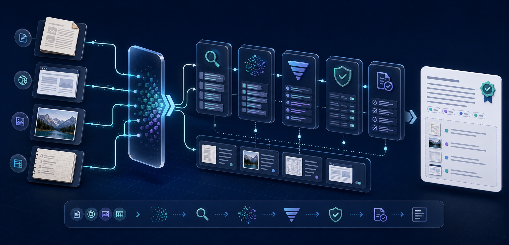

**从 PDF、网页、图片与笔记，到可解释、可拒答、可量化回归的证据链。**

[快速启动](#5-分钟离线启动) · [端到端案例](docs/case-study.md) · [产品巡游](docs/product-tour.md) · [现场验收](docs/production-validation.md) · [文档中心](docs/README.md) · [评测结果](docs/evaluation-results.md) · [安全模型](docs/security-model.md)

面向单用户真实日常使用的自托管多模态证据平台。它不只展示“上传并问答”，还把 BM25、向量召回、融合去重、MMR、Rerank、拒答决策和引用覆盖率组织成可理解、可回归的证据链。

默认使用 deterministic hash embedding、内存向量库和模板回答：**无需真实 API Key、不会调用付费 API**。PDF、DOCX、Markdown、文本、图片 OCR、URL 导入、持久会话、引用上下文、质量审计、反馈评测和专家参数均保留。

**0.3 Multimodal Intelligence** 将文档拆成可审查的 text、heading、image、table、equation、code 元素；原件与内嵌资源进入内容寻址对象存储，chunk 保留元素 provenance。上下文感知 enrichment 和 Graph-lite 只导航到本地 evidence，再与 BM25/vector 通过 RRF 融合，不能绕过拒答或引用门。工作台已支持 24 小时临时图片提问、精确元素定位、Graph SVG/表格 Trace 和多模态质量面板。索引任务的协作取消会可靠收敛到终态，SQLite 与对象存储可执行非破坏性隔离恢复演练。默认内置解析与 template enrichment 仍然零下载；MinerU、Docling、PaddleOCR 和视觉 Provider 均为可选。设计取舍见 [RAG-Anything 固定提交对比审查](docs/comparative-review-rag-anything.md)。

**0.4.0-rc.1 Production Local** 开始把“演示能力”和“受支持运行路径”明确分开：保留零 Key Demo，同时增加失败关闭的 Local Production 与 Production profile、Argon2id 会话认证、CSRF、登录限流、PostgreSQL metadata adapter、pgvector、S3/MinIO、ClamAV、Redis Streams、事务 outbox、DLQ 和带 checksum 的 SQLite→PostgreSQL 迁移。RC 不使用 `production-ready` 宣称；完成真实资料基准、恢复演练与 14 天持续运行门槛后才会发布 1.0。

2026-07-23 的私有 Production 验收已索引 **21 组有许可证来源 / 200 份非 fixture 文档 / 5,159 个 768 维向量**，并真实通过 PostgreSQL + pgvector + MinIO 破坏性恢复及 API、worker、Redis、PostgreSQL、MinIO 五类故障注入。MinerU 高级解析真实任务通过；Ollama embedding 通过，但 `qwen3:8b` 三类生成接口在本机 180 秒超时。持续观测如实记录了四次宿主机/容器运行时长间隔，并在每次超限后自然重置；截至 2026-07-26，最长连续窗口为 81,984 秒，当前窗口从 `2026-07-26T04:57:18Z` 重新开始。人工标注仍为 0/200、本人真实问题仍为 0/100，Sentry 因无 DSN 未验收。因此版本仍是 RC，完整证据与复现命令见[现场验收手册](docs/production-validation.md)。

同一版本还补齐日常使用闭环：可以订阅服务端白名单内的本地目录、URL 列表和 RSS/Atom，以内容 hash、ETag、Last-Modified 和稳定 external ID 做增量同步；空结果或部分失败不会触发批量删除，条目连续两次完整同步仍消失才进入人工确认。回答、会话和知识卡片均可导出带引用 Markdown。实现与安全边界见[持续数据源与增量同步](docs/source-sync.md)。

## 一分钟看懂


| 默认体验 | 可信度机制 | 工程证据 | 生产边界 |
| --- | --- | --- | --- |
| 零 Key、离线可运行 | 无证据拒答 | 179 个后端通过、3 个跳过 + 2 个 PostgreSQL contract | Argon2id session 与可选 Sentry |
| 多知识库、DOCX 与图片提问 | 十阶段检索 Trace | 27 个前端测试 | Chroma / pgvector adapter |
| 持久会话与流式回答 | 精确元素引用与 Graph provenance | 14 个 Browser E2E | Redis Streams / S3 / ClamAV |
| 可恢复索引任务 | 反馈 → eval draft | 100 条黄金回归 case | Demo、Local Production、Production 明确分层 |

这个仓库刻意同时展示三件事：**RAG 能力、工程可靠性、产品可信度**。如果只想快速体验，从[产品巡游](docs/product-tour.md)开始；如果要审查实现，阅读[架构](docs/architecture.md)和[检索原理](docs/retrieval-explained.md)；如果准备部署，直接查看[配置](docs/configuration.md)、[运维手册](docs/operations-runbook.md)与[生产适配](docs/production-adapters.md)。

## 适合用来做什么

- 在本地管理个人或小团队资料，并获得带引用回答。
- 演示一个可解释、可测试、能安全拒答的 RAG 工程作品集。
- 用固定黄金集回归 Recall@5、MRR、首条引用准确率和拒答准确率。
- 在同一界面比较简洁（普通）与调试（专家）模式，定位召回、排序、生成或引用问题。

它目前不是多租户 SaaS，也没有宣称默认 hash embedding 具备生产语义检索质量。三个运行模式、失败关闭规则和迁移步骤见 [Production Local 运行手册](docs/production-local.md)；扩展边界见 [生产适配方案](docs/production-adapters.md) 与 [已知边界](docs/known-limitations.md)。

## 能力地图

| 领域 | 已实现 | 默认离线 | 可选增强 |
| --- | --- | :---: | --- |
| 输入 | PDF、DOCX、Markdown、TXT、图片，以及 PNG/JPEG/WEBP/GIF 图片提问 | ✓ | Tesseract OCR / 视觉 Provider |
| 数据源 | 白名单目录、URL 列表、RSS/Atom 增量同步与人工删除确认 | ✓ | connector registry 可继续扩展 |
| 处理 | SQLite 任务、租约恢复、去重、终态取消、版本兼容 | ✓ | Production 使用 Redis Streams + outbox + DLQ |
| 检索 | 知识库隔离、BM25、vector、Graph-lite、RRF、MMR、rerank | ✓ | LightRAG 导航、local/OpenAI/Ollama embedding、Chroma、pgvector |
| 回答 | 持久会话、SSE、模板/Responses/chat/Ollama adapter | ✓ | 外部 Provider 人工验证 |
| 可信度 | no-answer gate、引用、相邻上下文、citation audit | ✓ | NLI/LLM judge 待规划 |
| 质量 | 反馈、eval draft、黄金集、Recall@K、MRR、引用/拒答 | ✓ | 真实流量抽样待规划 |
| 交付 | Nginx、FastAPI、三种 Compose profile、health/readiness、GitHub Actions | ✓ | SBOM、Trivy、CodeQL、容器签名 |
| 安全 | 上传边界、SSRF、防泄漏日志、Argon2id session、CSRF | ✓ | OIDC/RBAC 顺延至 1.1 |

## 5 分钟离线启动

要求：Python 3.11+、Node.js 22+。OCR 可选依赖由 Docker 镜像自动提供。

```bash
git clone https://github.com/728792899-create/personal-multimodal-rag.git
cd personal-multimodal-rag

python3 -m venv .venv
source .venv/bin/activate
python -m pip install -r backend/requirements.txt

npm ci
npm --prefix frontend ci
cp .env.example .env
npm run dev
```

另开终端导入仓库内脱敏示例资料：

```bash
source .venv/bin/activate
npm run demo:bootstrap
```

打开 [http://127.0.0.1:5173](http://127.0.0.1:5173)。`.env.example` 已默认配置：

```text
EMBEDDING_PROVIDER=mock
VECTOR_STORE=memory
ANSWER_PROVIDER=template
QUERY_REWRITE_PROVIDER=none
```

因此没有任何 Key 也能完成上传、索引、检索、回答、引用、拒答和评测流程。

## Docker Compose 一键启动

Docker 路径不要求先创建 `.env`：

```bash
docker compose up --build --wait -d
npm run demo:bootstrap
```

- 工作台：[http://127.0.0.1:5173](http://127.0.0.1:5173)
- 后端健康检查：[http://127.0.0.1:8010/health](http://127.0.0.1:8010/health)
- Provider 就绪检查：[http://127.0.0.1:8010/ready](http://127.0.0.1:8010/ready)

前端使用生产 Nginx 镜像，并将 `/api` 反向代理到 FastAPI；前后端都配置了容器健康检查。停止服务：

```bash
docker compose down
```

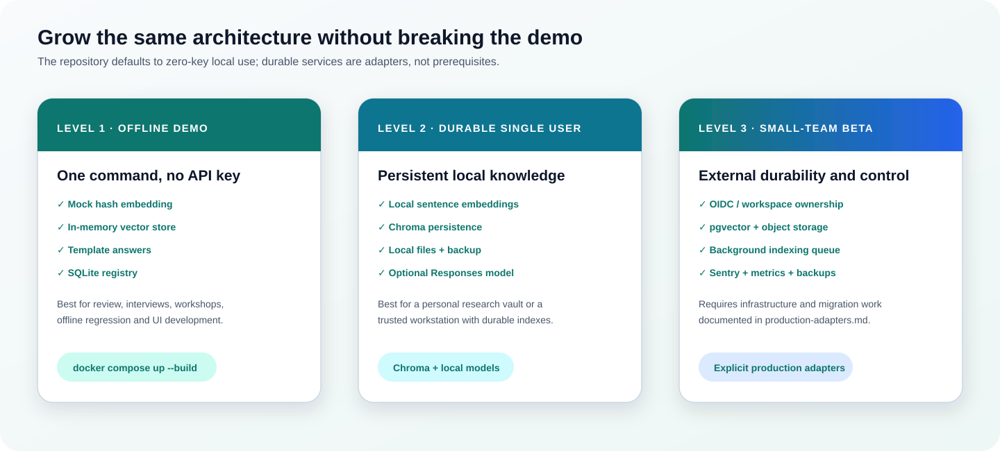

### 三种运行模式

| 模式 | 数据/检索 | Provider | 认证与失败策略 | 启动方式 |
| --- | --- | --- | --- | --- |
| `demo` | SQLite + 本地对象 + memory | mock + template | 默认关闭认证；零 Key | `docker compose up --build --wait -d` |
| `local-production` | SQLite + 本地对象 + Chroma | Ollama `qwen3:8b` + `nomic-embed-text` | 禁止 template 回退；可启用 session auth | `docker compose -f docker-compose.yml -f compose.local-production.yml up --build --wait -d` |
| `production` | PostgreSQL/pgvector + S3/MinIO + Redis Streams | Ollama 或 OpenAI-compatible | Argon2id session + CSRF；依赖异常时 readiness 503 | `docker compose -f compose.production.yml up --build --wait -d` |

Production profile 需要先生成 `secrets/` 中的本地 secret files；不会把密码或 Key写入镜像、Compose environment 或浏览器。完整前置检查、迁移和回滚见 [Production Local 运行手册](docs/production-local.md)。

要启用目录订阅，把宿主机目录通过 `SOURCE_DIRECTORY` 只读挂载；工作台只会看到配置好的根目录别名：

```bash
SOURCE_DIRECTORY="$HOME/Documents/knowledge" \
docker compose -f docker-compose.yml -f compose.local-production.yml up --build --wait -d
```

## 可复现验收

所有命令都强制使用离线 provider：

```bash
npm test                 # 后端 pytest + 前端 Vitest
npm run lint:docs        # 相对链接、图片 alt 与 SVG 可访问性
npm run build            # vue-tsc + Vite production build
npm run test:demo        # 端到端 API smoke
npm run eval:retrieval   # 100 条固定黄金集 + 12 项阈值
npm run eval:multimodal  # 44 条图像/表格/公式/版面专项
npm run eval:graph       # 10 条 provenance-backed 多跳专项
npm run test:restore-drill # SQLite + 对象存储隔离恢复契约
npm run test:e2e         # Chromium 桌面 + 390px 级移动视图
npm run verify:production # fail-closed Compose、认证/队列/对象、备份与 blocked release contract
```

一次运行全部验收：

```bash
npm run verify
```

当前本地验收证据见 [验证基线](docs/validation-baseline.md)。评测失败会生成可读报告到 `eval/reports/latest.md`；CI 会始终上传报告 artifact。

真实语料与运行证据不会被 fixture 代替。`npm run benchmark:real` 只接受部署方提供的私有 evidence manifest；当前 1.0 状态和全部阻断项见[发布证据](docs/release-evidence-1.0.md)。

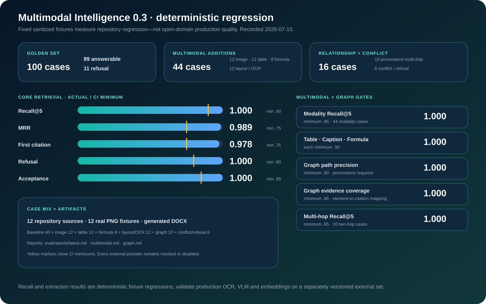

| 检查 | 当前本地结果 | CI 门槛 |
| --- | ---: | ---: |
| 后端测试 | 179 passed、3 skipped + 2 PostgreSQL contract passed | 全部通过 |
| 前端单元/组件 | 27 passed | 全部通过 |
| Browser E2E | 14 passed | 桌面与移动全部通过 |
| Recall@5 | 1.0000 | ≥ 0.90 |
| MRR | 0.9888 | ≥ 0.75 |
| 首条引用准确率 | 0.9775 | ≥ 0.75 |
| 拒答准确率 | 1.0000 | ≥ 0.80 |
| 回答接受准确率 | 1.0000 | ≥ 0.85 |
| Modality Recall@5 / 表格 / Caption / 公式 | 全部 1.0000 | ≥ 0.85 / 0.90 |
| Graph path precision / evidence coverage / 多跳 Recall@5 | 全部 1.0000 | ≥ 0.90 / 0.95 / 0.85 |

> 上表是仓库内固定、脱敏、小规模黄金集的回归结果，用于发现代码退化，不代表开放域或真实业务语料上的绝对质量。

完整的数据集构成、判定方式与限制见[固定黄金集评测结果](docs/evaluation-results.md)。

## 核心体验

### 界面图集

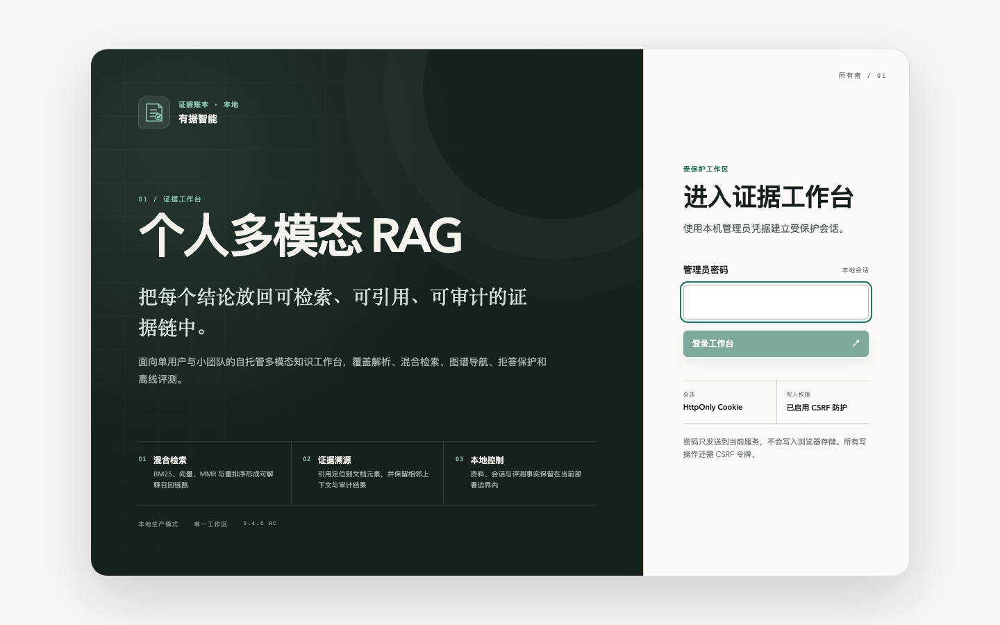

默认首页采用 **Question-first** 单画布：普通使用者只看到问题、回答与来源；文件上传和知识库管理收进资料库抽屉，检索 Trace 收进检索调试抽屉。`⌘/Ctrl + K` 可随时聚焦问题，`Esc` 关闭抽屉，调试模式才展开 BM25、向量、Graph、MMR 与 rerank 参数。

| 问答首页 | 检索调试 | 390px 窄屏 |
| --- | --- | --- |
| 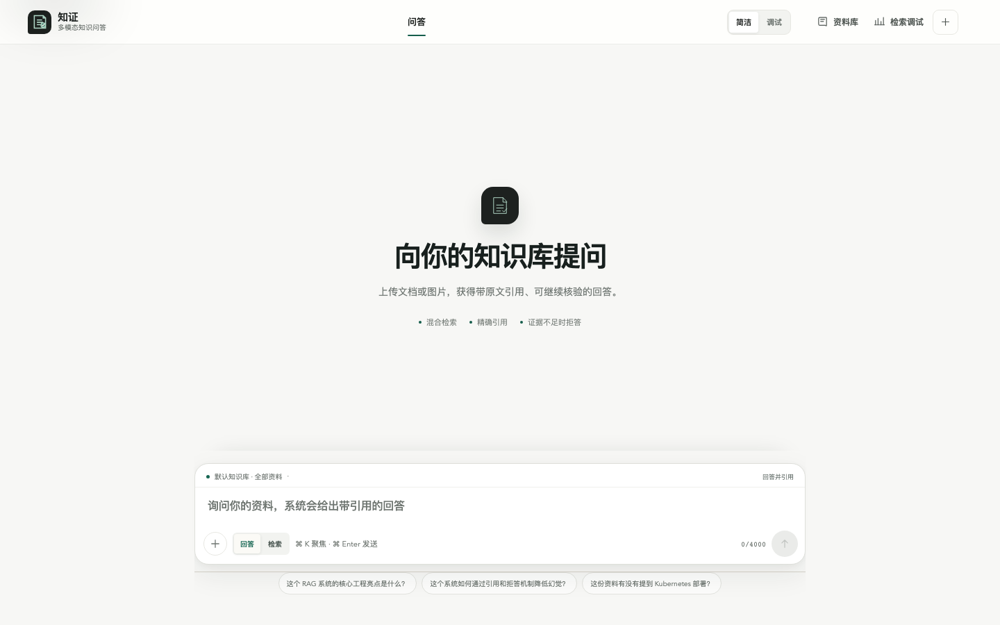 | 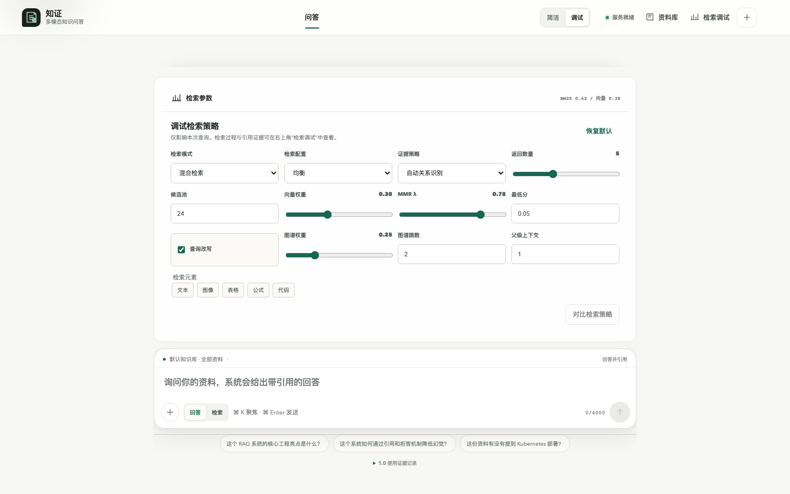 | 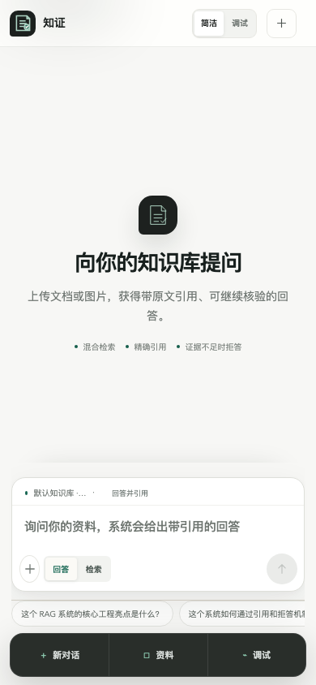 |
| 单一问题画布，系统信息默认隐藏 | 仅在调试模式展示检索策略 | 上传、资料和调试入口始终可达，无横向溢出 |

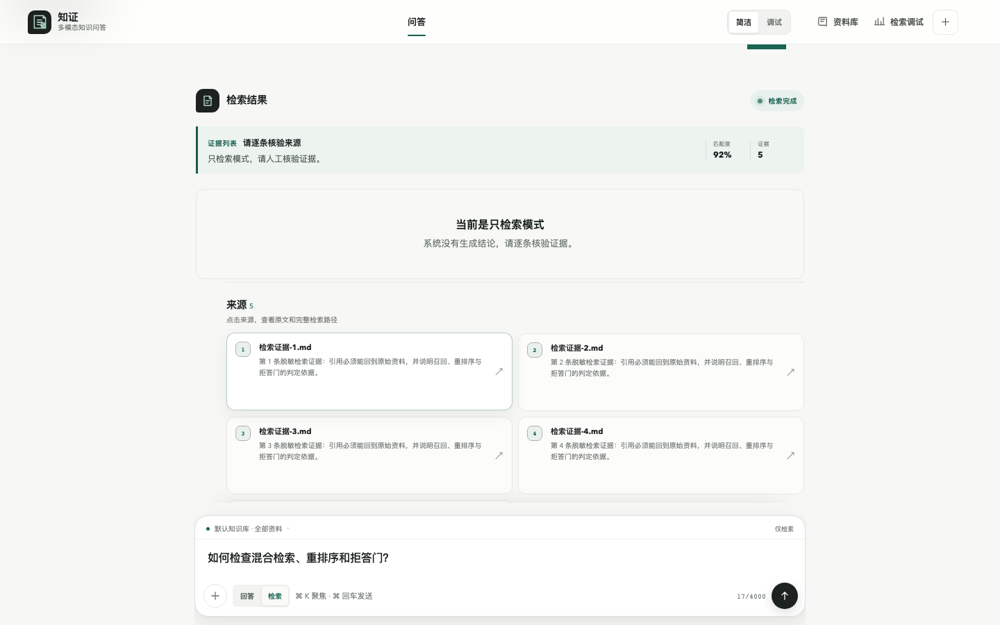

简洁模式不会暴露 Provider、召回权重或原始检索分值；结果首先呈现匹配状态和来源，点击来源后才进入证据与调试抽屉。

### 关键工作流

资料库抽屉承载文件上传、URL 导入和索引状态；来源抽屉提供相邻上下文、质量与引用审计；反馈可生成评测草稿；失败状态保留请求 ID 和重试动作。多模态图片提问、Graph 证据导航及精确元素引用均在当前界面的按需抽屉中完成，不再在首页混入历史 UI。

完整的逐步说明见[端到端案例](docs/case-study.md)、[产品巡游](docs/product-tour.md)与[截图验证索引](docs/screenshots/README.md)。

### 简洁（普通）模式

- 创建/切换知识库，上传 PDF、DOCX、Markdown、文本、PNG/JPEG，或导入公开 URL。
- 在任务中心查看排队、分块、嵌入、写入、失败、取消与重试状态。
- 选择知识库或指定文档范围，在持久会话中获得流式、证据约束回答。
- 查看引用片段、相邻上下文、置信度和引用覆盖率。
- 对无证据问题明确拒答，不把向量噪声包装成结论。
- 负反馈一键生成 eval draft。
- 可添加最多 4 张临时图片，离线 OCR/元数据或视觉 Provider 会在检索前扩展查询。

### 调试（专家）模式

- 调整 `search_mode`、profile、Top K、candidate K、向量权重、MMR λ 与最低分。
- 比较 BM25-only、Vector-only、Hybrid、Hybrid + Rerank。
- 查看十阶段 Trace：查询增强 → BM25 → 向量 → 融合 → Graph → 父级上下文 → MMR → Rerank → 回答/拒答 → 引用审计。
- 查看 fallback、query rewrite、耗时、文档质量、操作日志和评测草稿。

设计评审工作文件：[Figma · Personal Multimodal RAG Beta](https://www.figma.com/design/r2oFc38SGqh8QPvFykEEfq)。前端实现以同一组语义 token、间距、圆角、焦点和状态规范为准。

## 架构


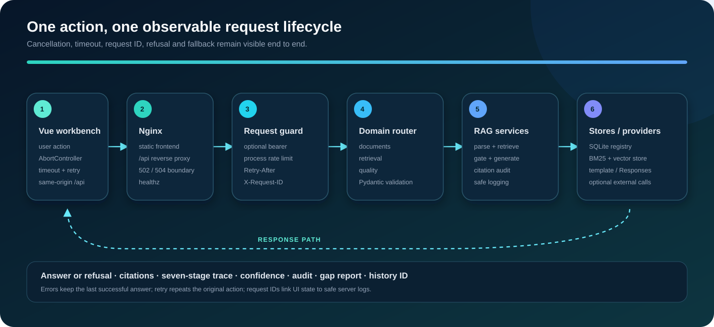

<details>
<summary>展开 Mermaid 实现链路</summary>

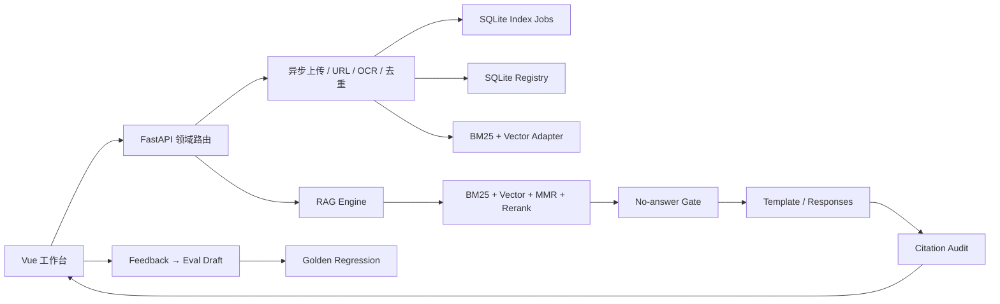

</details>

前端已经从单体 `App.vue` 拆成页面、领域组件、`useWorkbench` composable 与 `api/{client,documents,retrieval,quality}`；后端原 `routes.py` 现在只做路由组合，文档、检索、质量路由分别维护。详见[代码导览](docs/code-tour.md)、[架构说明](docs/architecture.md)与[SQLite 数据模型](docs/data-model.md)。

### 十阶段检索

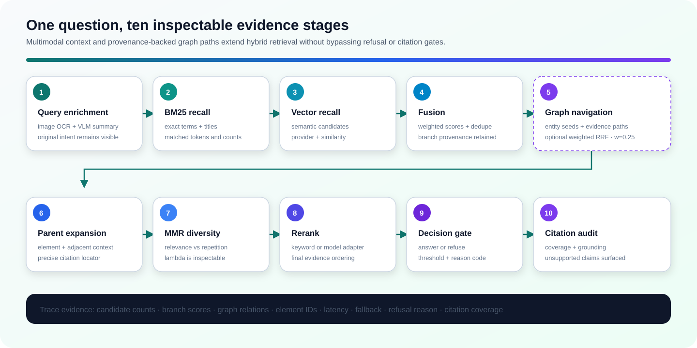

十阶段视图依次显示查询增强、BM25、向量、融合、Graph、父级上下文、MMR、Rerank、拒答决策和引用审计；Graph 路径另有可缩放 SVG 与等价键盘表格。计算与诊断方法见[检索与可信回答](docs/retrieval-explained.md)。

## 安全与稳定性

- 上传扩展名白名单、20 MB 上限、空文件拒绝、路径清理、唯一落盘名、PDF/图片 magic-byte 和 DOCX ZIP-bomb 校验。
- 查询图片最多 4 张/单张 10 MB，实际解码校验 PNG/JPEG/WEBP/非动画 GIF、像素上限、知识库边界和 24 小时过期级联删除。
- URL 仅允许 HTTP(S)，禁止嵌入凭据，初始/重定向/最终地址都执行 SSRF 校验，并限制内容类型、字节数和超时。
- API 支持可选 Bearer Token、进程内限流、`Retry-After` 和请求 ID。
- 前端请求有超时、取消、Abort 语义、可读错误、请求 ID 与重试入口。
- 日志会清理 Authorization、token、password、secret、URL query/fragment。
- Sentry 仅在显式提供 DSN 且安装可选依赖时启用；默认关闭 PII 与 request body。
- Production URL/Feed 只由无 secret、无数据卷的隔离 fetch worker 抓取；每一跳重新验证 DNS，并把 socket 固定到已验证公网 IP。
- `/metrics` 只输出低基数 Prometheus label；可选 OTLP、Sentry scrubber 和 Grafana 均禁止正文、问题、Cookie、Key 与 URL query。
- SQLite 任务以租约恢复进程中断工作，最多三次自动尝试；协作取消和过期的 `cancelling` 租约都会收敛为 `cancelled`，内容哈希与索引版本组成幂等键。
- `memory` 向量库重启时会从 SQLite 文档注册表重建缺失索引；维度/模型/索引版本不兼容的文档被标记 `needs_rebuild`，不混用向量。
- `scripts/verify_local_restore.py` 使用 SQLite Backup API 在临时目录检查完整性、外键、schema，以及引用对象的安全路径、大小和 SHA-256；完整恢复步骤见[运维手册](docs/operations-runbook.md)。

安全策略与漏洞报告见 [SECURITY.md](SECURITY.md)。

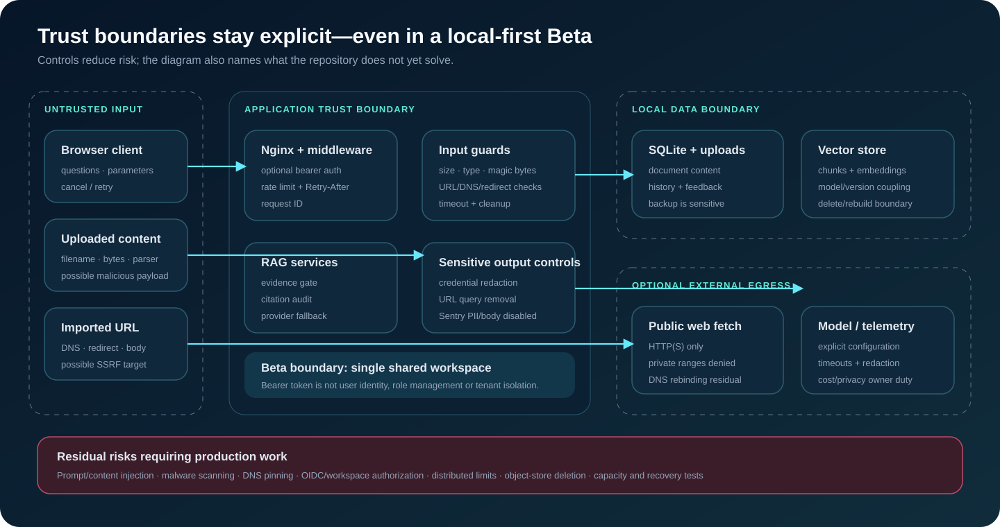

具体威胁、已实现控制和剩余风险见[安全威胁模型](docs/security-model.md)。

## OpenAI 可选接法

默认运行不需要 OpenAI。若显式选择真实 provider：

- Responses 使用 `POST /v1/responses` 和 `store:false`；流式消费 `response.output_text.delta`、`response.completed` 与 `error`，会话事实保存在本地 SQLite。
- Embedding 使用批量 `input` 与 `encoding_format=float`；`dimensions` 只在配置非零且模型支持时发送。
- 网络客户端有超时且错误文本经过脱敏；只有 local/test 显式允许模板回退，production 默认以安全 `503` 失败。

配置示例见 `.env.example`。实现按 [OpenAI Streaming Responses](https://developers.openai.com/api/docs/guides/streaming-responses)、[Conversation state](https://developers.openai.com/api/docs/guides/conversation-state) 和 [Embeddings API](https://developers.openai.com/api/reference/resources/embeddings/methods/create) 校对。

## 目录

```text
backend/app/
  api/routes.py              # 路由组合根
  api/routers/               # documents / ingestion / KB / conversations / providers / quality
  middleware/                # auth / rate limit / request id
  services/                  # ingest / retrieval / answer / audit / adapters
frontend/
  src/pages/                 # WorkbenchPage
  src/components/            # knowledge / query / answer / inspector / trace
  src/composables/           # useWorkbench + context
  src/api/                   # client + 领域 API + types
  e2e/                       # Playwright 关键路径
eval/                        # cases + thresholds
samples/demo-documents/      # 公开脱敏样例
docs/                        # 架构、部署、排障、发布与证据
```

## CI 与发布

GitHub Actions 按职责拆分：

- `ci.yml`：文档、后端、前端构建/单测/E2E、黄金集、多模态/Graph/parser 安全契约和默认 Compose 健康检查。
- `security.yml`：CodeQL、Python/npm 依赖审计、Trivy、SPDX SBOM 与 Production contract。
- `release-images.yml`：仅对 release/tag 构建固定镜像，生成 provenance/SBOM，并使用 GitHub OIDC 做 keyless Cosign 签名与 build attestation。
- 高级 parser 和真实 Provider 继续使用显式手动 workflow，普通 PR 不下载模型、不调用付费 API。

`0.4.0-rc` 的固定 fixture 回归与基础设施 contract 可由 CI 自动复现；真实语料、14 天 soak 与完整恢复演练必须由部署负责人提交私有 evidence manifest。`GET /api/system/readiness-report` 会明确返回每一道通过/阻断门，不能由 fixture 自动把版本标记为 1.0。badge 反映默认分支最近一次 `ci.yml` 状态；发布前仍需逐项执行 [Release Checklist](docs/release-checklist.md)。

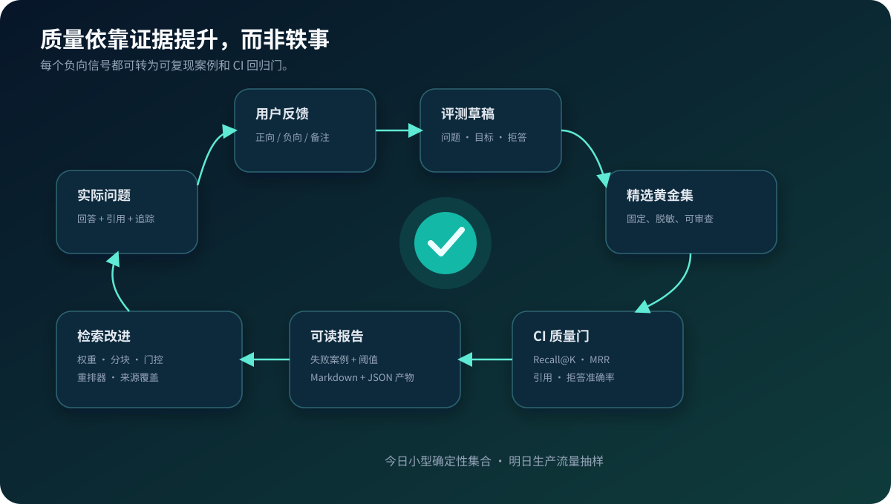

## 更多文档

| 我想要…… | 从这里开始 | 继续深入 |
| --- | --- | --- |
| 看完整使用案例 | [端到端案例](docs/case-study.md) | [产品巡游](docs/product-tour.md) |
| 快速理解产品 | [产品巡游](docs/product-tour.md) | [演示脚本](docs/demo-script.md) |
| 审查代码结构 | [代码导览](docs/code-tour.md) | [数据模型](docs/data-model.md) |
| 审查检索质量 | [检索原理](docs/retrieval-explained.md) | [测试与评测](docs/testing-and-evaluation.md) |
| 查看固定成绩 | [评测结果](docs/evaluation-results.md) | [验证基线](docs/validation-baseline.md) |
| 集成后端 | [API 使用指南](docs/api-reference.md) | [架构说明](docs/architecture.md) |
| 切换 provider | [配置指南](docs/configuration.md) | [生产适配方案](docs/production-adapters.md) |
| 运行和排障 | [运维手册](docs/operations-runbook.md) | [故障排查](docs/troubleshooting.md) |
| 评估上线条件 | [已知边界](docs/known-limitations.md) | [Release Checklist](docs/release-checklist.md) |
| 查看真实证据 | [发布证据与阻断门](docs/release-evidence-1.0.md) | [验证基线](docs/validation-baseline.md) |
| 参与开发 | [贡献指南](CONTRIBUTING.md) | [路线图](docs/roadmap.md) |
| 解决常见疑问 | [FAQ](docs/faq.md) | [安全策略](SECURITY.md) |
| 审查威胁边界 | [安全模型](docs/security-model.md) | [生产适配](docs/production-adapters.md) |

## 关键设计取舍

- **离线优先，不是离线限定。** 默认路径保证任何审查者都能复现，真实模型通过 adapter 接入。
- **拒答优先于流畅。** 没有证据时给出缺口，比生成看似完整的答案更符合知识工具定位。
- **Trace 服务于决策。** 不展示无组织的 debug JSON，而是按检索因果顺序组织信息。
- **回归指标互相制衡。** Recall 防漏召回，MRR 防排序退化，引用防错来源，拒答防无依据扩张。
- **服务端决定 workspace。** 0.4 RC 已建立默认 workspace/owner/session/membership 边界；仍是单管理员单实例，不把它包装成多租户或 RBAC。
- **真实截图与概念配图分工。** 截图证明产品状态，SVG/主视觉解释系统关系，两者都不能代替自动化测试。

## 参与与安全

欢迎提交可复现的 bug、评测 case、可访问性改进和 adapter 增强。开始前请阅读 [CONTRIBUTING.md](CONTRIBUTING.md)。安全问题不要公开披露或附带真实资料，请使用 GitHub Private Security Advisory，流程见 [SECURITY.md](SECURITY.md)。

## License

[MIT](LICENSE)
