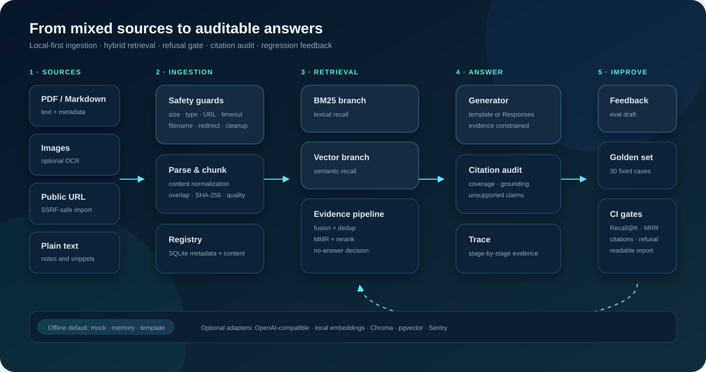
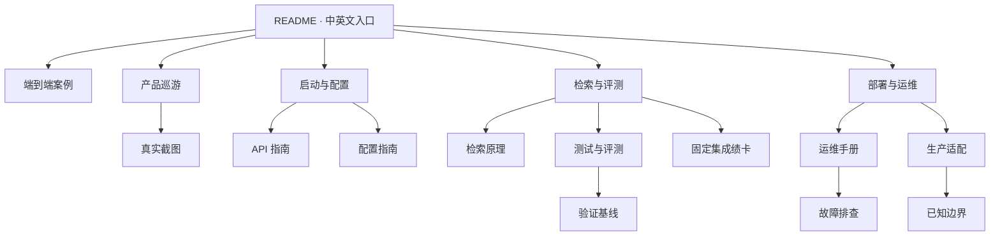

# 文档中心

[中文项目入口](../README.md) · [英文概览](../README.en.md)

这里是个人多模态 RAG 的完整说明入口。README 负责快速判断项目价值；本目录负责解释行为、实现、运行和边界。



## 按角色阅读

### 第一次体验

1. [端到端案例](case-study.md)
2. [产品巡游](product-tour.md)
3. [5 分钟启动](../README.md#5-分钟离线启动)
4. [演示脚本](demo-script.md)
5. [常见问题](faq.md)

### 前端/产品

1. [产品巡游](product-tour.md)：问题优先的信息架构、按需抽屉、普通/调试模式和状态设计。
2. [截图清单](screenshots/README.md)：真实桌面、检索追踪与移动端拒答证据。
3. [架构说明](architecture.md)：页面、组件、组合式逻辑与 API 分层。
4. [前端状态机](assets/frontend-state-machine.svg)：加载、错误、取消与重试。
5. [贡献指南](../CONTRIBUTING.md)：可访问性和端到端测试要求。

### RAG/评测

1. [检索与可信回答](retrieval-explained.md)
2. [测试与评测](testing-and-evaluation.md)
3. [固定黄金集评测结果](evaluation-results.md)
4. [验证基线](validation-baseline.md)
5. [已知边界](known-limitations.md)

### 后端/集成

1. [持续数据源与增量同步](source-sync.md)
2. [耐久本地版 0.2：迁移与恢复](durable-local-0.2.md)
3. [API 使用指南](api-reference.md)
4. [配置指南](configuration.md)
5. [代码导览](code-tour.md)
6. [SQLite 数据模型](data-model.md)
7. [`rag-web-ui` 对比审查](comparative-review-rag-web-ui.md)
8. [RAG-Anything 对比审查](comparative-review-rag-anything.md)
9. [安全威胁模型](security-model.md)
10. [安全策略](../SECURITY.md)

### 部署/运维

1. [本地生产候选版 0.4](production-local.md)
2. [生产现场验收](production-validation.md)
3. [1.0 发布证据与阻断项](release-evidence-1.0.md)
4. [运维手册](operations-runbook.md)
5. [生产适配方案](production-adapters.md)
6. [故障排查](troubleshooting.md)
7. [发布检查清单](release-checklist.md)

### 维护者

1. [贡献指南](../CONTRIBUTING.md)
2. [路线图](roadmap.md)
3. [项目复盘](project-retrospective.md)
4. [变更记录](../CHANGELOG.md)

## 文档地图



## 配图规范

- `assets/multimodal-rag-hero.png`：用于概念解释的 AI 生成主视觉，不作为产品验收证据。
- `assets/*.svg`：代码原生、可审查的系统图，修改时同步更新关联文档。
- `screenshots/*`：浏览器实际运行截图，用来证明界面与状态。
- 所有图片必须提供具体替代文本，说明图中关系或被验证的状态。

详细来源和维护方式见 [assets/README.md](assets/README.md) 与 [screenshots/README.md](screenshots/README.md)。

## 文档变更验收

```bash
git diff --check
xmllint --noout docs/assets/*.svg
npm run build
```

同时检查：相对链接存在、图片可渲染、命令可复制、配置与 `.env.example` 一致、指标与 `eval/thresholds.json` 一致、边界没有被营销文案夸大。
