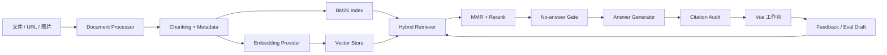
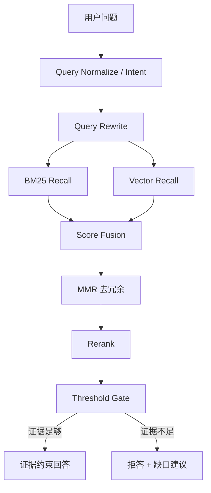
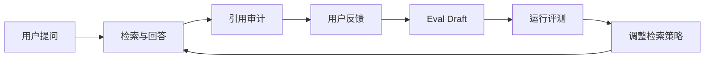

# 架构说明

## 总体架构

## 关键模块

| 模块 | 文件 | 职责 |
| --- | --- | --- |
| 文档解析 | `backend/app/services/document_processor.py` | 文件/文本解析、chunk 切分、metadata |
| URL 导入 | `backend/app/services/url_importer.py` | 抓取网页、清洗正文、生成文档 |
| 检索器 | `backend/app/services/retriever.py` | BM25、向量召回、MMR、rerank 前候选 |
| RAG 引擎 | `backend/app/services/rag_engine.py` | 问答编排、拒答、trace、parent context |
| 引用审计 | `backend/app/services/citation_audit.py` | 引用覆盖率、unsupported claims |
| 知识工具 | `backend/app/services/knowledge_tools.py` | 改写、知识卡片、缺口分析 |
| 系统指标 | `backend/app/services/system_metrics.py` | 文档质量、置信度、反馈和日志统计 |
| 前端工作台 | `frontend/src/App.vue` | 普通/专家模式、引用、评测、卡片 |

## 检索链路

## 数据闭环

## 设计取舍

- 没有直接依赖 LangChain，是为了展示 RAG 核心链路和工程拆分能力。
- 默认 mock embedding 可离线运行，真实演示可切换 local/OpenAI-compatible embedding。
- 普通模式隐藏复杂参数，专家模式展示 trace 和调参入口。
- Citation audit 先采用规则可解释实现，后续可升级为 NLI/LLM-as-judge。

