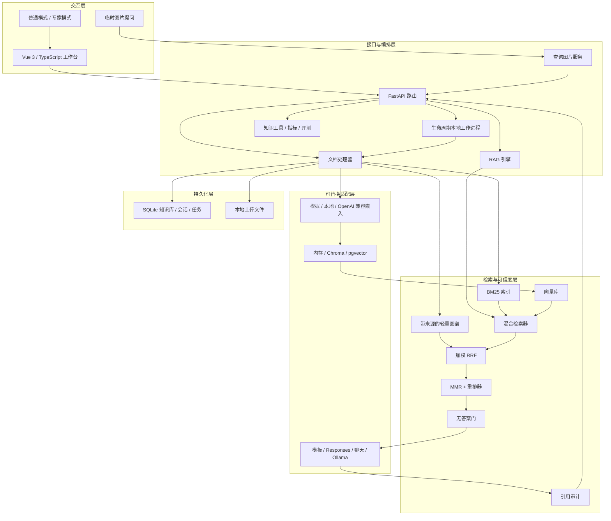
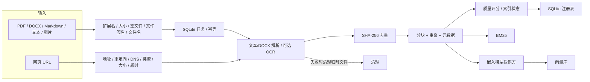
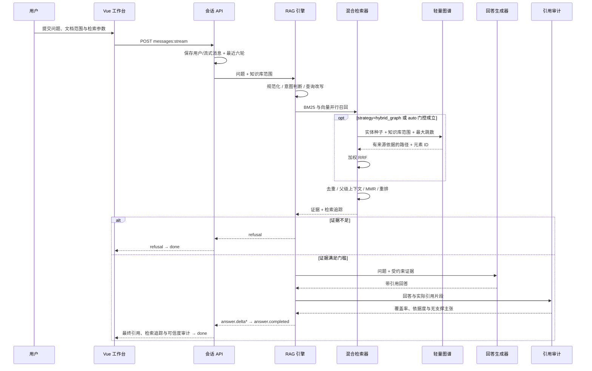
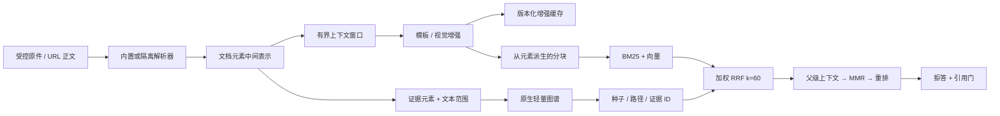
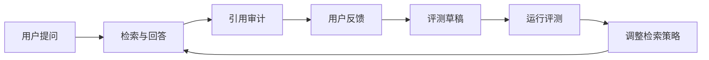
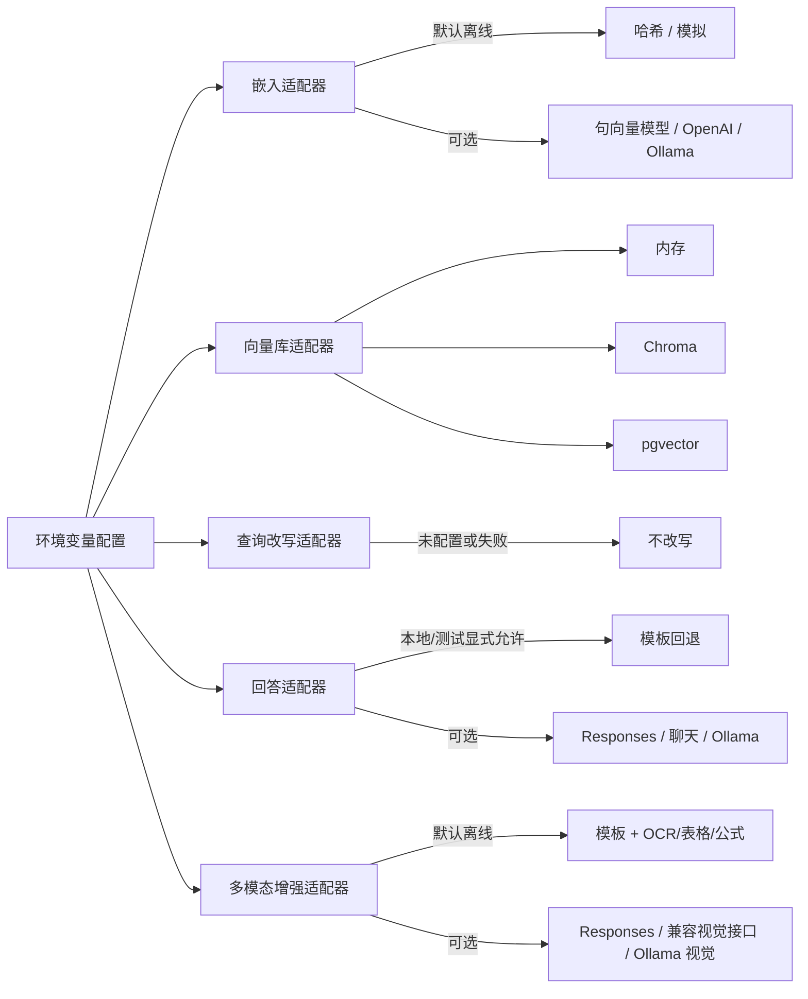

# 架构说明

这张图用于快速理解系统边界；下面的 Mermaid 图展示更接近代码模块的依赖关系。默认离线链路与可选生产适配器使用同一套领域接口。

## 1. 系统分层

## 关键模块

| 模块 | 文件 | 职责 |
| --- | --- | --- |
| 文档解析 | `backend/app/services/document_processor.py` | PDF/DOCX/文本/OCR、分块切分、元数据 |
| 多模态增强 | `backend/app/services/{context_window,multimodal_enrichment}.py` | 有界相邻上下文、确定性/视觉结构化描述与缓存 |
| 查询图片 | `backend/app/services/query_assets.py` | 签名/像素/大小校验、OCR/视觉增强、知识库边界与 TTL 清理 |
| 轻量图谱 | `backend/app/services/{graph_store,graph_adapters}.py` | 来源节点/边、路径、知识库隔离和 LightRAG 导航白名单 |
| 韧性执行 | `backend/app/services/resilience.py` | 超时类错误重试、指数退避、抖动与熔断 |
| 入库任务 | `backend/app/services/ingestion_jobs.py` | SQLite 认领、租约、重试、取消、阶段进度 |
| URL 导入 | `backend/app/services/url_importer.py` | 抓取网页、清洗正文、生成文档 |
| 检索器 | `backend/app/services/retriever.py` | BM25、向量召回、MMR、重排前候选 |
| RAG 引擎 | `backend/app/services/rag_engine.py` | 问答编排、拒答、检索追踪、父级上下文 |
| 引用审计 | `backend/app/services/citation_audit.py` | 引用覆盖率、无支撑主张 |
| 知识工具 | `backend/app/services/knowledge_tools.py` | 改写、知识卡片、缺口分析 |
| 系统指标 | `backend/app/services/system_metrics.py` | 文档质量、置信度、反馈和日志统计 |
| 前端页面 | `frontend/src/pages/WorkbenchPage.vue` | 问题优先画布、按需抽屉与普通/调试模式 |
| 前端状态 | `frontend/src/composables/useWorkbench.ts` | 请求取消、重试、状态与领域动作 |
| 领域状态 | `frontend/src/composables/use{KnowledgeBases,IngestionJobs,Conversations,ProviderStatus,MultimodalQuery,DocumentViewer,GraphTrace,QualityAudit}.ts` | 知识库、任务、SSE、图片、元素、图谱与审计 |
| 前端 API | `frontend/src/api/` | 超时/错误客户端与文档/检索/质量 API |
| 后端路由 | `backend/app/api/routers/` | 文档/检索/质量领域路由 |

更适合按请求阅读的文件级入口见[代码导览](code-tour.md)。

## 2. 资料入库与安全边界

URL 导入默认拒绝回环、内网、链路本地和特殊地址。校验不只发生在初始 URL，还覆盖重定向与最终响应，避免通过跳转绕过 SSRF 防线。

## 3. 问答检索时序

## 4. 元素、增强与图谱证据流

这条链有两个硬边界：模型提供方提取的关系必须在原元素中找到 `evidence_span`；图谱输出必须先映射回本地分块才能进入排序。图边本身不能满足回答门槛。

## 5. 反馈与评测闭环

## 6. 模型提供方与降级策略

默认演示链路完全离线，目的是让代码审查和面试演示可复现；真实模型、持久向量库和交叉编码器属于可替换增强项，不能把默认哈希嵌入的效果描述成生产检索质量。

## 7. 启动恢复与容器边界

SQLite 保存文档、知识库、会话、消息与任务。启动时恢复过期租约，再加载注册表并验证嵌入维度/模型/索引版本；只为兼容且缺失的文档重建索引。不兼容记录进入 `needs_rebuild`，不会混入当前检索。

字段、删除语义和迁移顺序见[SQLite 数据模型](data-model.md)。

Compose 的 Nginx 只暴露静态前端与 `/api` 代理，FastAPI `/ready` 返回当前模型提供方状态。前后端健康检查与 `depends_on: condition=service_healthy` 防止前端在后端未就绪时被标记为整体可用。

## 设计取舍

- 没有直接依赖 LangChain，是为了展示 RAG 核心链路和工程拆分能力。
- 默认模拟嵌入可离线运行，真实演示可切换本地/OpenAI 兼容嵌入。
- 普通模式隐藏复杂参数，专家模式展示检索追踪和调参入口。
- 引用审计先采用规则可解释实现，后续可升级为 NLI/LLM 判断器。

## 延伸阅读

- [产品巡游](product-tour.md)：从用户动作理解信息架构与状态。
- [检索与可信回答](retrieval-explained.md)：阶段、分数、拒答和诊断。
- [API 使用指南](api-reference.md)：端点、请求负载与错误语义。
- [配置指南](configuration.md)：模型提供方、存储、门槛与安全配置。
- [生产适配方案](production-adapters.md)：工作区、任务、pgvector 与对象存储。
- [安全威胁模型](security-model.md)：信任边界、已实现控制与剩余风险。
