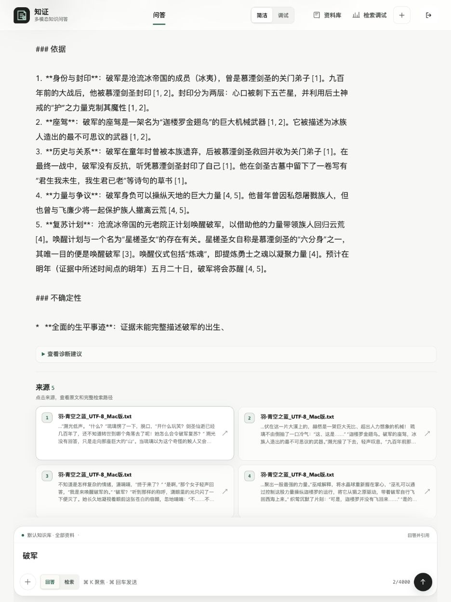
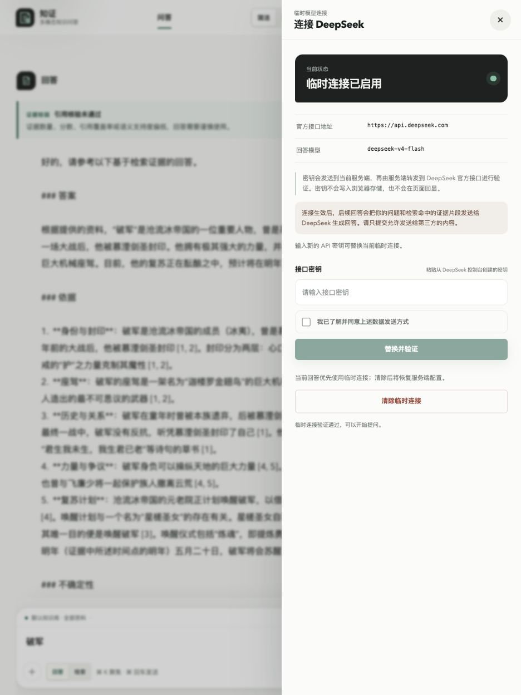
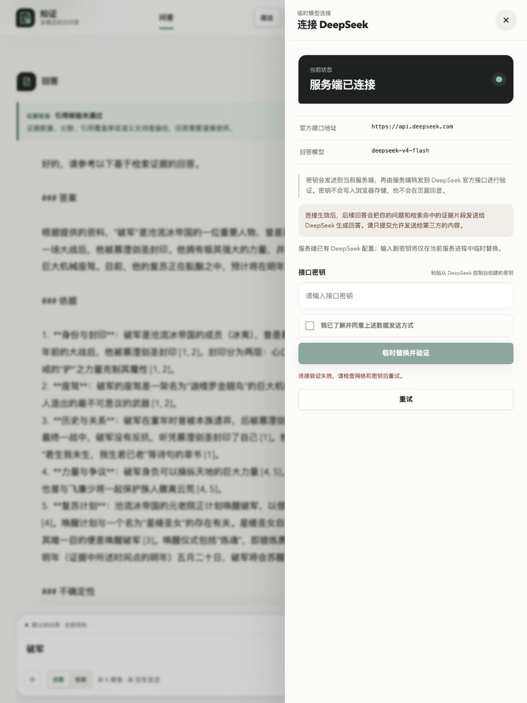
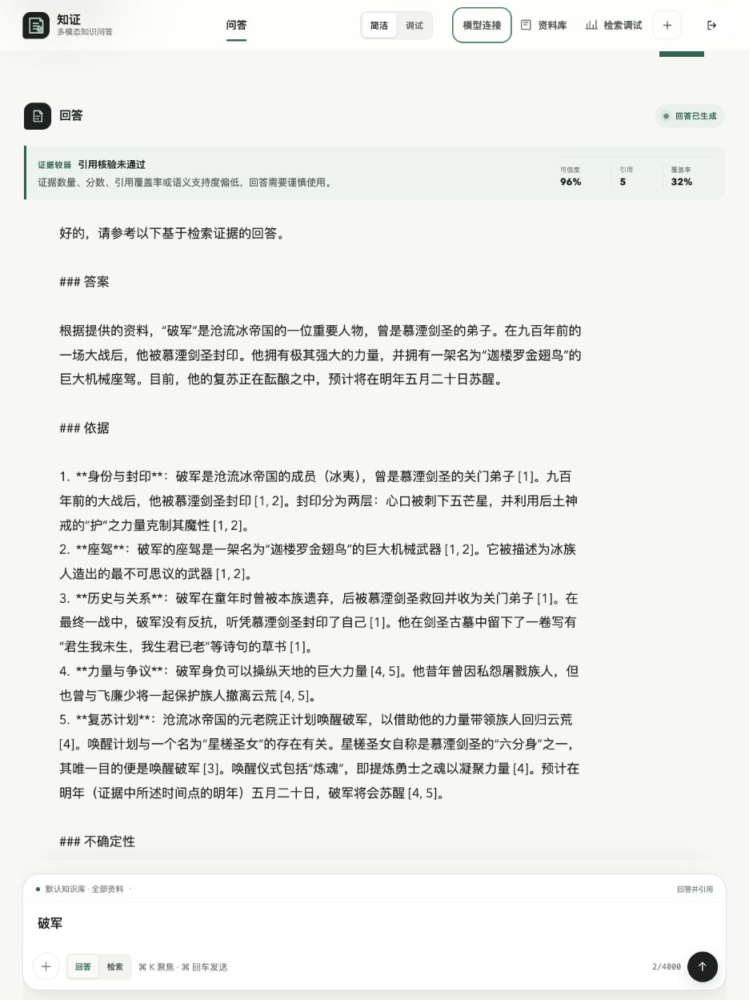

# DeepSeek 首页连接验收

日期：2026-07-28

环境：Production Compose + PostgreSQL + Redis + MinIO + DeepSeek 官方接口

结论：入口、权限、连接、清除、错误恢复、刷新恢复和 390px 断点均通过；密钥未出现在截图、接口响应或浏览器持久化中。

## 1. 入口与信息层级

状态：通过

旧首页没有模型连接入口：

新版本在主导航提供“模型连接”，详细配置收进右侧抽屉，不挤占问答主流程。面板明确展示固定的官方接口地址、模型、密钥流向和回答数据外发边界。

## 2. 官方连接与安全确认

状态：通过

只有受保护的所有者或管理员会话可以提交；用户必须先确认问题与命中证据会发送给 DeepSeek。浏览器使用本地密钥文件完成一次真实 `GET /models` 验证，未发起生成请求。连接成功后显示“临时连接已启用”，输入框立即清空：

## 3. 清除、失败与恢复

状态：通过

- 清除临时连接后恢复启动时的服务端 DeepSeek 配置。
- 使用无效测试凭据时显示脱敏错误，原服务端连接保持可用，页面不回显输入值。
- 关闭抽屉不会中止已提交的连接操作；重新打开会主动刷新真实状态。

## 4. 会话持久化与问答主流程

状态：通过

重建后端与刷新 Browser 后，当前对话、问题、回答、来源和引用审计仍被恢复；没有回到空白初始页：

## 5. 响应式与无障碍

状态：通过

- 在 390 × 844 视口验证移动端“模型”入口、全宽抽屉、关闭按钮和完整表单。
- 桌面与移动入口均具有 `aria-expanded` 和 `aria-controls`。
- 抽屉支持焦点圈定、`Esc` 关闭与焦点返回。
- loading、success、error、retry、disabled 和无权限状态均有中文语义。

## 6. 工程证据

状态：通过

- 后端：232 通过、3 跳过；全程禁用外部网络。
- 前端：60/60 通过，生产构建通过。
- 文档、敏感信息扫描与 `git diff --check` 通过。
- Production Compose 中 backend、worker、PostgreSQL、Redis、MinIO、ClamAV、fetch-worker、frontend 与 soak-monitor 全部健康。
- Redis Streams：pending 0、lag 0；PostgreSQL 活跃索引任务 0；保留 2 条历史 DLQ 记录供审计。
- Soak SHA-256 链有效；14 天持续运行、200 条人工标注、100 次本人真实提问和 Sentry 真实 DSN 仍未达标，因此版本仍为候选版。
