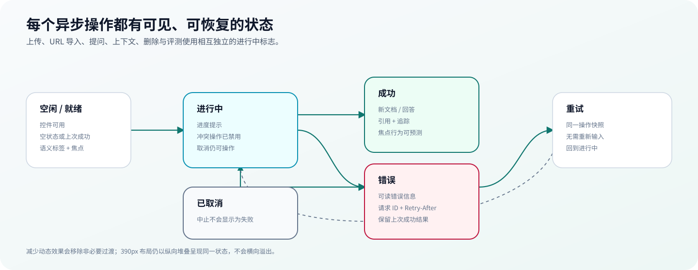

# 代码导览

这份导览帮助评审者从一次浏览器请求进入代码，而不是按目录逐个猜职责。项目保持稳定的 API/schema，同时把前端单体与后端组合根拆成可独立测试的领域模块。

## 一次请求如何流动

1. `frontend/src/pages/WorkbenchPage.vue` 组织三栏工作台与普通/专家模式。
2. 领域组件触发 `frontend/src/composables/useWorkbench.ts` 中的动作。
3. `frontend/src/api/client.ts` 统一处理 base URL、超时、Abort、错误 payload 和 request ID；`documents.ts`、`retrieval.ts`、`quality.ts` 保持领域边界。
4. Docker 模式下 Nginx 把 `/api` 代理到 FastAPI；本地 Vite 使用同一路径语义。
5. `backend/app/main.py` 注册 CORS、请求保护中间件、健康检查与 API 组合根。
6. `backend/app/middleware/request_guards.py` 处理可选 bearer、进程限流、`Retry-After` 和 `X-Request-ID`。
7. `backend/app/api/routes.py` 只组合 documents、retrieval、quality 三组领域路由。
8. service 层执行入库、检索、回答、引用审计或质量计算；`core/store.py` 组装共享 adapter。
9. provider 异常经过脱敏后回退或形成可读错误；响应沿原路径返回，前端进入 success、error、cancel 或 retry 状态。

## 前端地图

| 路径 | 关注点 | 适合从这里修改 |
| --- | --- | --- |
| `src/pages/WorkbenchPage.vue` | 页面布局与模式切换 | 信息架构、响应式组合 |
| `src/components/knowledge/` | 上传、URL、文档列表 | 入库体验与文档状态 |
| `src/components/query/` | 提问与专家参数 | 请求参数与 disabled 状态 |
| `src/components/answer/` | 回答、引用、反馈 | 可信度与失败闭环 |
| `src/components/inspector/` | Trace、指标、质量 | 可解释性与审计视图 |
| `src/components/trace/` | 七阶段流程卡 | BM25/vector/MMR/rerank 诊断 |
| `src/composables/useWorkbench.ts` | 领域状态与动作 | loading、cancel、retry、数据刷新 |
| `src/api/client.ts` | 网络边界 | 超时、错误映射、request ID |
| `src/api/*.ts` | 领域 API | endpoint 和 schema 对接 |

每个异步动作使用独立 pending/error 状态，避免上传阻塞问答或一次失败清空其他区域。键盘、焦点、窄屏和 reduced-motion 属于组件验收条件，不是页面最后补丁。

## 后端地图

| 路径 | 职责 | 关键边界 |
| --- | --- | --- |
| `api/routers/documents.py` | 上传、URL、删除、重建 | 类型/大小/SSRF/源文件清理 |
| `api/routers/retrieval.py` | search、ask、context、history | 参数归一化、Trace、引用上下文 |
| `api/routers/quality.py` | feedback、eval、metrics、cards | 草稿与黄金集分离 |
| `services/document_processor.py` | 解析、chunk、metadata | parser/OCR 的输入边界 |
| `services/retriever.py` | BM25、vector、fusion、MMR | 候选与排序可观测性 |
| `services/rag_engine.py` | 问答编排与 no-answer gate | 回答/拒答决策 |
| `services/answer_generator.py` | template/Responses adapter | 外部回答 provider fallback |
| `services/citation_audit.py` | 覆盖率与 unsupported claims | 规则审计的已知局限 |
| `services/document_registry.py` | SQLite registry | 当前单 workspace 数据边界 |
| `services/vectorstore.py` | memory/Chroma/pgvector adapter | 持久化和维度兼容 |

## 三条典型路径

### 上传

`POST /api/documents` → 安全文件名 → 分块写入和大小限制 → magic bytes → 解析/OCR → 内容哈希去重 → chunk → BM25/vector → SQLite registry → 操作日志。

任何失败都会清理尚未接受的临时文件；删除只允许移除受控上传目录中的直接文件，不跟随任意路径。

### 提问

`POST /api/ask` → request schema → retrieval options → query intelligence/rewrite → hybrid retrieval → MMR/rerank → evidence gate → template/Responses → citation audit → history + operation log → UI。

Trace 保留每阶段候选数、耗时、fallback 与最终决策。Rerank 只能重新排序已有候选，不能修复前序漏召回。

### 反馈

`POST /api/feedback` → 关联 history snapshot → 保存 rating/failure type → 生成 eval draft → 更新反馈统计。草稿通过 `GET /api/eval/drafts` 查看，但只有经过人工审查的固定 case 才进入 CI 黄金集。

## 扩展点

- 新 embedding：实现现有 embedding 接口，并在配置工厂中显式注册；先补尺寸、批处理、超时和 fallback 测试。
- 新 vector store：实现 add/search/delete/existing chunk 语义；验证重启 hydration 和删除一致性。
- 新 reranker：保持输入候选与 trace schema；加入排序单测和黄金集回归。
- 多 workspace：先把授权与 `workspace_id` 注入所有查询/存储，再迁移数据；不能只在前端增加筛选。
- 后台索引：把上传接受与索引完成拆成任务状态，设计幂等键、重试、死信与取消；不能让 HTTP worker 偷偷承担长任务。

进一步阅读：[架构说明](architecture.md)、[数据模型](data-model.md)、[安全威胁模型](security-model.md)、[测试与评测](testing-and-evaluation.md)。
