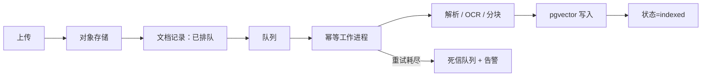

# 生产适配方案

本文件区分“候选版已实现的边界”和“需要外部基础设施后才能完成的部署工作”。没有外部服务时，默认本地演示模式始终可运行。

## 能力矩阵

| 关注点 | 本地候选版 | 生产建议 | 状态 |
| --- | --- | --- | --- |
| 身份 | 演示模式可关闭；本地模式可启用会话 | Argon2id 管理员、HttpOnly Cookie、CSRF、撤销 | 单管理员已实现；OIDC/RBAC 顺延 |
| 工作区 | 服务端解析默认工作区/所有者/成员关系 | `workspace_id` 贯穿仓储层 | 单工作区已实现；多租户未宣称 |
| 索引任务 | SQLite 事实源 + 租约/重试/取消 | Redis Streams 消费者组 + 发件箱 + 死信队列 | 适配器/契约已实现；真实容量待验收 |
| 向量 | 内存 / Chroma | pgvector + 维度/模型版本门 | 适配器/契约已实现；真实容量待验收 |
| 文件 | 内容寻址本地对象 | S3/MinIO 暂存 → ClamAV → 可用 | 适配器/Compose 已实现；真实恢复待验收 |
| 限流 | 单进程滑动窗口 | Redis/网关按用户/工作区限流 | 未部署 Redis |
| 可观测性 | 请求 ID、脱敏日志、Prometheus `/metrics` | OTLP + Grafana + 可选 Sentry | 适配器/仪表盘已实现；告警目标由部署方配置 |

## 认证与工作区边界

推荐让身份网关验证用户，并向后端传递经过签名/可信网络保护的 `sub` 与工作区声明。不要接受浏览器自行声明 `workspace_id`。

最小生产架构：

```text
workspaces(id, name, created_at)
memberships(workspace_id, user_id, role)
knowledge_bases(id, workspace_id, ...)
documents(id, workspace_id, knowledge_base_id, object_key, content_hash, status, ...)
chunks(id, workspace_id, document_id, embedding_model, ...)
conversations/messages(id, workspace_id, user_id, ...)
index_jobs(id, workspace_id, idempotency_key, lease, ...)
eval_cases(id, workspace_id, ...)
```

每个仓储层/服务方法都必须接收服务端解析出的工作区上下文；数据库查询和对象键同时限定工作区。PostgreSQL 可再加 RLS 作为纵深防御。

内置 `API_AUTH_TOKEN` 适合单用户 API 或由可信反向代理注入的共享边界，不解决用户身份、角色、撤销和审计问题，也不应通过 `VITE_*` 打进浏览器构建产物。

## 后台索引任务

生产上传应分为：



0.2 已使用 `knowledge_base + content/url hash + embedding/index/chunker version` 生成本地幂等键，并公开稳定任务状态机。迁出时在键中增加服务端工作区；删除流程先把文档标为 `deleting`，再异步删除向量和对象，最终写审计事件；工作进程必须能安全处理重复投递。

## pgvector

1. 安装 `backend/requirements-optional.txt` 中的 `psycopg`/`pgvector`。
2. 创建独立数据库用户与受限架构，不使用超级用户连接应用。
3. 配置 `VECTOR_STORE=pgvector`、`PGVECTOR_DSN`、表名与嵌入维度。
4. 为 `workspace_id`、`document_id` 和向量索引建立迁移；当前候选版适配器创建的是单表基础结构，真正多工作区前必须迁移。
5. 嵌入模型或维度变化时写入新版本/新表，完成回填后切换，不原地混用维度。

## 对象存储

- 原始文件使用不可预测对象键，不把用户文件名当对象键。
- 上传设置 MIME/大小限制、校验哈希、病毒扫描和生命周期策略。
- 数据库只保存对象键与安全元数据；下载用短期签名 URL。
- 删除与备份恢复必须覆盖原始对象、派生 OCR、分块和向量。

## 可观测性

已提供请求 ID、脱敏日志、低基数 Prometheus `/metrics`、可选 OTLP/Sentry 初始化和 Grafana 仪表盘。当前覆盖：

- HTTP/索引任务延迟、错误、重试、队列深度；
- 检索零命中、回退、拒答、引用覆盖率分布；
- 嵌入/重排模型提供方费用与限额；
- 数据源同步、首个令牌、索引重试/死信队列、模型提供方错误/费用（无费用元数据时明确为 0）；
- Sentry/OTLP 脱敏器，禁止正文、问题、Cookie、密钥和完整 URL 查询参数。

部署方仍需配置持久指标后端、告警路由与保留期，并用合成敏感数据执行一次遥测泄漏抽查。

## 人工部署步骤

由于仓库没有云账号、域名、OIDC 租户、Postgres/S3/Redis/Sentry 凭据，以下必须由部署负责人完成：创建服务、写入密钥管理器、运行迁移、配置 TLS/域名、验证备份恢复、执行容量测试、设置告警和回滚策略。
