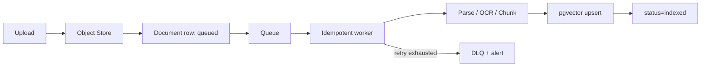

# 生产适配方案

本文件区分“Beta 已实现的边界”和“需要外部基础设施后才能完成的部署工作”。没有外部服务时，默认本地 Demo 始终可运行。

## 能力矩阵

| 关注点 | 本地 Beta | 生产建议 | 状态 |
| --- | --- | --- | --- |
| 身份 | Demo 可关闭；Local 可启用 session | Argon2id 管理员、HttpOnly cookie、CSRF、撤销 | 单管理员已实现；OIDC/RBAC 顺延 |
| 工作区 | 服务端解析默认 workspace/owner/membership | `workspace_id` 贯穿 repository | 单 workspace 已实现；多租户未宣称 |
| 索引任务 | SQLite 事实源 + lease/retry/cancel | Redis Streams consumer group + outbox + DLQ | adapter/契约已实现；真实容量待验收 |
| 向量 | memory / Chroma | pgvector + 维度/模型版本门 | adapter/契约已实现；真实容量待验收 |
| 文件 | 内容寻址本地对象 | S3/MinIO 暂存 → ClamAV → 可用 | adapter/Compose 已实现；真实恢复待验收 |
| 限流 | 单进程滑动窗口 | Redis/网关按 user/workspace 限流 | 未部署 Redis |
| 可观测性 | request ID、脱敏日志、Prometheus `/metrics` | OTLP + Grafana + 可选 Sentry | adapter/dashboard 已实现；告警目标由部署方配置 |

## 认证与工作区边界

推荐让身份网关验证用户，并向后端传递经过签名/可信网络保护的 `sub` 与 workspace claims。不要接受浏览器自行声明 `workspace_id`。

最小生产 schema：

```text
workspaces(id, name, created_at)
memberships(workspace_id, user_id, role)
knowledge_bases(id, workspace_id, ...)
documents(id, workspace_id, knowledge_base_id, object_key, content_hash, status, ...)
chunks(id, workspace_id, document_id, embedding_model, ...)
conversations/messages(id, workspace_id, user_id, ...)
index_jobs(id, workspace_id, idempotency_key, lease, ...)
eval_cases(id, workspace_id, ...)
```

每个 repository/service 方法都必须接收服务端解析出的 workspace context；数据库查询和对象 key 同时限定 workspace。PostgreSQL 可再加 RLS 作为纵深防御。

内置 `API_AUTH_TOKEN` 适合单用户 API 或由可信反向代理注入的共享边界，不解决用户身份、角色、撤销和审计问题，也不应通过 `VITE_*` 打进浏览器 bundle。

## 后台索引任务

生产上传应分为：



0.2 已使用 `knowledge_base + content/url hash + embedding/index/chunker version` 生成本地幂等键，并公开稳定任务状态机。迁出时在键中增加服务端 workspace；删除流程先把文档标为 deleting，再异步删除向量和对象，最终写审计事件；worker 必须能安全处理重复投递。

## pgvector

1. 安装 `backend/requirements-optional.txt` 中的 `psycopg`/`pgvector`。
2. 创建独立数据库用户与受限 schema，不使用超级用户连接应用。
3. 配置 `VECTOR_STORE=pgvector`、`PGVECTOR_DSN`、表名与 embedding dimension。
4. 为 `workspace_id`、`document_id` 和向量索引建立迁移；当前 Beta adapter 创建的是单表基础结构，真正多 workspace 前必须迁移。
5. embedding 模型或维度变化时写入新版本/新表，完成回填后切换，不原地混用维度。

## 对象存储

- 原始文件使用不可预测 object key，不把用户文件名当 key。
- 上传设置 MIME/大小限制、校验 hash、病毒扫描和生命周期策略。
- 数据库只保存 object key 与安全 metadata；下载用短期签名 URL。
- 删除与备份恢复必须覆盖原始对象、派生 OCR、chunk 和向量。

## 可观测性

已提供 request ID、脱敏日志、低基数 Prometheus `/metrics`、可选 OTLP/Sentry 初始化和 Grafana dashboard。当前覆盖：

- HTTP/索引任务 latency、error、retry、queue depth；
- 检索 zero-hit、fallback、refusal、citation coverage 分布；
- embedding/rerank provider cost 与限额；
- source sync、first-token、索引重试/DLQ、Provider error/cost（无 cost metadata 时明确为 0）；
- Sentry/OTLP scrubber，禁止正文、问题、Cookie、Key 和完整 URL query。

部署方仍需配置持久 metrics backend、告警路由与 retention，并用合成敏感数据执行一次 telemetry 泄漏抽查。

## 人工部署步骤

由于仓库没有云账号、域名、OIDC tenant、Postgres/S3/Redis/Sentry 凭据，以下必须由部署负责人完成：创建服务、写入 secret manager、运行迁移、配置 TLS/域名、验证备份恢复、执行容量测试、设置告警和回滚策略。
