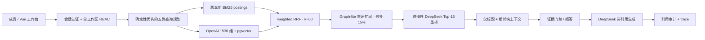

# Personal Multimodal RAG 质量型 v1.0 升级

本文是 `1.0.0-rc.1` 的实现说明与上线运行手册。目标运行形态是单工作区、5–10 人内部团队；生产环境的回答、查询规划和选择性重排使用 DeepSeek，嵌入使用 OpenAI `text-embedding-3-large` 的 1536 维输出，检索数据保存在 PostgreSQL + pgvector。

> **发布状态：blocked。** RC 代码和离线契约不等于 `v1.0.0` 已发布。仓库没有包含或声称已经完成 200 条真实人工标注、配置冻结后的 100 条真实盲测、50k 分块 HNSW 实测、全量 OpenAI 重建、分阶段灰度或 14 天 soak。完整阻断项见[发布证据](release-evidence-1.0.md)。旧版现场记录继续保留在[验证基线](validation-baseline.md)，但 768 维旧索引和本地模型结果不能作为 Retrieval v2 的验收证据。

## 1. 生产架构



生产检索链固定为：

`查询路由 → 按需改写/拆解 → BM25 + Dense 并行召回 → weighted RRF → Graph-lite → 选择性重排 → 父上下文扩展 → 证据门禁 → 带引用生成`

关键边界：

- PostgreSQL 是向量、叶块和 BM25 postings 的服务期事实来源；Web 进程启动时不把全量向量或分块重新加载到应用内存。
- `knowledge_base_id`、`document_id` 和 `modality` 在 SQL 中下推过滤。过滤后候选不超过 2,000 时使用精确 cosine 搜索，否则使用 HNSW。
- HNSW 初始参数是 `m=16`、`ef_construction=128`。影子索引验证会比较 `ef_search=40/80/120/200`，只有满足 Recall 门槛的最低值才可以进入活动版本；RC 尚未提供目标规模实测结果。
- 稀疏、稠密和图通道不混合原始分数，而以 `k=60` 的 weighted reciprocal rank fusion 融合。
- Graph-lite 只能通过带 provenance 的元素映射回已有分块，默认一跳、最多两跳，贡献不超过融合权重的 15%，不能形成 graph-only answer。
- 每次请求开始时固定活动索引版本，直到检索和父上下文读取完成；切换指针不会让同一请求混用两个索引。

## 2. 结构化分块与引用

`structure-v2` 分块器按页面、标题路径、段落和类型化元素边界工作：

- 正文叶块目标为 350–650 个中文字符，硬上限 900；约 80 字重叠只发生在同一页、同一标题路径内。
- 表格、图片、公式和代码是独立元素。超大表格按行窗口切分，并在每个窗口重复表头。
- 嵌入文本由“文档标题 + section path + 叶块”组成；标题路径也作为独立字段保存。
- 检索和排序以叶块为单位，排序后才补父标题和 `±1` 相邻块；引用 ID 始终落在叶块，并保留页码、元素 ID 与可用的 bbox。
- 发布前仍须用真实数据对 `structure-v2` 与旧 520/90 策略做消融；Recall 差距小于 0.5 个百分点时，选择平均上下文 Token 更少的方案。

## 3. 五路查询规划

新界面默认发送 `routing_mode: "auto"`。旧客户端不发送该字段时保持 `manual`，继续执行原有 `search_mode`、`search_profile`、`strategy` 和权重。自动规划只能缩小或保持用户指定的文档、知识库和模态范围，不能扩大范围。

| 路由 | 识别与行为 | 默认权重/策略 | 最终证据上限 |
| --- | --- | --- | ---: |
| `exact` | 编号、日期、引号或专名；不改写 | BM25 / Dense = 0.7 / 0.3；不重排 | 8 |
| `semantic` | 普通语义问答；保留原问，最多 2 个改写 | 0.45 / 0.55；Top-10 重合少于 3 或版本冲突时重排 | 8 |
| `composite` | 比较或多个问题；拆成 2–4 个子问题 | 0.5 / 0.5；默认重排，每个子问题保留证据 | 10 |
| `multihop` | 关系或因果链；最多两跳 | 0.45 / 0.55；Graph-lite + 默认重排 | 10 |
| `summary` | 仅限明确指定文档或知识库的总结 | 0.4 / 0.6；不改写、不重排 | 8 |

确定性规则置信度达到 0.85 时直接执行；低于 0.85 才请求 DeepSeek 返回严格 JSON。外部模型只能选择路由、列出安全决策因素和最多 3 个派生查询，不能改变访问范围。章节预测只参与加权，不是硬过滤条件。

每个自动请求的硬预算是：

- 原问加最多 3 个派生查询；
- 每个分支最多 40 个候选；
- RRF 融合池 40；
- DeepSeek 最多重排 16 个既有候选，只能返回候选 ID 和分数；
- 普通问答最多 8 个叶块，复合/多跳最多 10 个叶块；
- Graph-lite 最多两跳，第二跳实体必须来自第一跳证据。

`retrieval_trace.plan` 只公开结构化决策信息：`route`、`confidence`、`decision_factors`、`subqueries`、`modifiers`、`source`、`index_version`、`degraded` 和 `fallbacks`。它不返回模型思维过程。

## 4. 受控降级

| 故障 | 服务行为 | 禁止行为 |
| --- | --- | --- |
| 查询规划失败或返回非法 JSON | 原问按 balanced hybrid 执行，并记录 fallback | 不采纳越界子查询 |
| DeepSeek 重排超时或非法输出 | 保留 RRF 顺序 | 不新增候选或伪造分数 |
| OpenAI 嵌入失败 | 仅高置信 `exact` 可继续 BM25，并照常经过证据门禁；其他路由明确拒答 | 不切换本地嵌入 |
| DeepSeek 回答生成失败 | 返回已检索证据、结构化故障状态和重试入口 | 不生成模板答案 |
| 图边无 provenance 或图证据过期 | 跳过图通道，继续稀疏/稠密结果 | 不允许 graph-only answer |
| 证据不足或冲突无法解决 | 正常业务拒答并保留 trace | 不把无证据回答包装成成功生成 |

生产设置必须保持 `PROVIDER_FALLBACK_ALLOWED=0`。所有降级写入 trace 和低基数运行指标，但日志、响应和可观测事件不得包含密钥、文档原文或模型内部推理。

## 5. 本地成员账号与 RBAC

`AUTH_MODE=session` 启用本地成员账号。用户名唯一，密码使用 Argon2id，普通密码和临时密码均至少 12 位；没有公开注册接口。管理员创建成员时提供临时密码，成员首次登录必须先改密，改密后重新登录。

| 能力 | `admin` | `editor` | `viewer` |
| --- | :---: | :---: | :---: |
| 查询、查看引用、自己的会话与反馈 | ✓ | ✓ | ✓ |
| 上传、同步、编辑知识库、提交标注 | ✓ | ✓ | — |
| 成员创建/禁用/改角色/重置密码 | ✓ | — | — |
| 删除知识库、全量重建、索引切换/回滚 | ✓ | — | — |
| 模型状态、全局历史、操作/指标与发布审计 | ✓ | — | — |

服务端每次请求重新检查用户状态和 membership，而不是信任客户端自报的 `role` 或 `workspace_id`。禁用账号、修改角色、管理员重置密码和用户改密会撤销受影响账号的全部会话。系统拒绝删除、禁用或降级最后一个管理员。历史 `owner` 只用于迁移兼容，持久 membership 会迁移到 `admin`，不再作为产品角色展示。

## 6. 影子索引运行手册

所有 `/api/indexes*` 接口都要求 `admin` 会话和 CSRF。状态流为：

`candidate → stable → active → rollback`

`activate` 在一个事务中更新 `active_index_id`、`previous_index_id` 和 generation。`rollback` 只指向上一套已经验证的 OpenAI 1536 维稳定快照；旧本地模型或旧维度表只能保留作审计，不能作为 v1 服务回滚目标。

首次启动只会创建 `rag_chunks_v2_initial` 物理 staging 表，不会把空表登记成活动或可回滚快照。没有完成数据级验证的 active index 时，健康检查和检索都失败关闭。在旧版仍承担流量时，先重建、验证、promote 并 activate 一套完整的云端基线；这一步只用于建立控制面基线，不得对外切流。随后再建立并验证正式候选。只有第二次 activate 才是首次正式切换，它必须把已验证基线写入非空的 `previous_index_id`，从而可立即事务回滚。

### 6.1 查看当前状态

```http
GET /api/indexes
GET /api/indexes/active
```

响应同时包含索引记录和工作区活动指针。切换前记录当前 `active_index_id`、`previous_index_id` 和 generation。

### 6.2 创建候选

```http
POST /api/indexes/candidates
Content-Type: application/json

{
  "index_id": "retrieval-v2-20260809",
  "parser_version": "builtin-elements-v1",
  "chunker_version": "structure-v2",
  "source_index_id": "retrieval-v2-stable",
  "embedding_provider": "openai",
  "embedding_model": "text-embedding-3-large",
  "embedding_dimension": 1536
}
```

省略 `table_name` 时，服务生成经过校验的 `rag_chunks_v2_*` 表名。不要复用现有 `index_id`，也不要向活动表混写不同模型、维度、解析器或分块器的数据。

### 6.3 先做 10% 费用预演

下面的 CLI 会从 `METADATA_DSN_FILE` / `PGVECTOR_DSN_FILE` 读取数据连接，并在 `--execute-provider` 时真实调用 OpenAI；生产环境只使用文件型密钥。

```bash
.venv/bin/python scripts/rebuild_shadow_index.py dry-run \
  --index-id retrieval-v2-20260809 \
  --dry-run-percent 10 \
  --execute-provider \
  --output data/reports/retrieval-v2-dry-run.json
```

报告中的 Token、耗时和预计费用必须经过人工确认。全量实际 Token/费用相对预演投影的偏差不得超过 15%；否则 `cost_projection_within_15_percent` 不通过。

### 6.4 通过耐久任务重建

```http
POST /api/indexes/retrieval-v2-20260809/rebuild
Content-Type: application/json

{"benchmark_samples": 100}
```

接口返回 `202` 和现有 durable index job。工作进程从原始 Document/Element 注册表幂等生成叶块，同时写入向量和 postings；相同文档的 chunk ID、内容哈希及各版本字段完全一致时跳过，任一签名变化时只替换该候选表中的对应文档。

任务完成后检查 `/api/index-jobs/{id}`。不要把“任务进入 succeeded”单独当作可切换依据；同一任务还会运行结构校验、HNSW Recall 比较和引用解析检查。

### 6.5 验证

可重复运行只读验证：

```bash
.venv/bin/python scripts/rebuild_shadow_index.py validate \
  --index-id retrieval-v2-20260809 \
  --benchmark-samples 100 \
  --output data/reports/retrieval-v2-validation.json
```

候选必须同时通过：文档数、分块数、内容哈希、OpenAI 模型、1536 维、解析/分块版本、零空向量、零非有限值、零重复 chunk ID、全部引用可解析、HNSW Recall 和 15% 费用偏差。管理员接口 `PUT /api/indexes/{index_id}/validation` 用于受控验证器回写上述 checklist；它不是人工绕过验证的“绿灯”接口。

### 6.6 promote、补增量和 activate

所有 validation 为 true 后才能执行：

```http
POST /api/indexes/retrieval-v2-20260809/promote
```

`promote` 只把候选标记为 `stable`，不会切流。首次正式切换前，`GET /api/indexes/active` 必须已经返回另一套完整验证的 OpenAI 1536 维基线；如果 active 为空，先在不承担生产流量的状态下，对基线候选重复执行本节的 dry-run、rebuild、validate、promote 和 activate。系统不会为空 staging 表伪造基线。

确认可回滚基线后，正式切换仍需执行以下人工运行步骤；RC 尚未提供自动语料写入冻结接口：

1. 在入口和同步调度层暂停上传、删除、来源同步及其他语料写入。
2. 对 stable 候选再次执行幂等 rebuild，补齐冻结前增量。
3. 再次 validate，保存只读报告与对象/文档计数。
4. 在同一变更窗口激活：

```http
POST /api/indexes/retrieval-v2-20260809/activate
```

5. 读取 `/api/indexes/active` 确认活动版本、generation，以及 `previous_index_id` 正好指向切换前的已验证基线，再恢复语料写入。

### 6.7 rollback

发现权限绕过、索引污染、数据丢失、虚构引用，或 10 分钟内 5xx 超过 5% 时立即执行：

```http
POST /api/indexes/rollback
```

回滚的是完整上一稳定索引指针；路由、模型和重排配置还必须由部署配置版本一起回退。目标 RTO 不超过 10 分钟、源数据 RPO 为 0。旧表至少保留 30 天用于审计，但只有上一套 OpenAI 1536 维稳定快照可作为服务回滚目标。

## 7. 生产 secrets 与模型边界

`APP_ENVIRONMENT=production` 或 `RAG_RUNTIME_MODE=production` 任一成立时，模型密钥只允许从 Docker secrets 对应的 `*_API_KEY_FILE` 读取。直接设置 `OPENAI_API_KEY`、`ANSWER_API_KEY`、`QUERY_REWRITE_API_KEY`、`RETRIEVAL_AUX_API_KEY` 或 `ENRICHMENT_API_KEY` 会让配置失败关闭；独立的影子索引命令对 `METADATA_DSN`、`PGVECTOR_DSN` 和 `OPENAI_API_KEY` 执行同样规则。

生产 OpenAI embedding 使用 SDK 默认地址；如显式设置 `OPENAI_BASE_URL`，只接受 `https://api.openai.com` 或其 `/v1` 根路径。本地地址、代理域名、HTTP 和伪子域都会在 Web 或工作进程构造模型客户端前被拒绝。

生产 Compose 的关键配置是：

```env
APP_ENVIRONMENT=production
RAG_RUNTIME_MODE=production
PROVIDER_FALLBACK_ALLOWED=0

VECTOR_STORE=pgvector
PGVECTOR_DSN_FILE=/run/secrets/metadata_dsn
EMBEDDING_PROVIDER=openai
EMBEDDING_MODEL=text-embedding-3-large
EMBEDDING_DIMENSION=1536
OPENAI_API_KEY_FILE=/run/secrets/openai_api_key

ANSWER_PROVIDER=openai_compatible_chat
ANSWER_BASE_URL=https://api.deepseek.com
ANSWER_MODEL=deepseek-v4-flash
ANSWER_API_KEY_FILE=/run/secrets/deepseek_api_key

RETRIEVAL_AUX_PROVIDER=deepseek
RETRIEVAL_AUX_BASE_URL=https://api.deepseek.com
RETRIEVAL_AUX_MODEL=deepseek-v4-flash
RETRIEVAL_AUX_API_KEY_FILE=/run/secrets/deepseek_api_key
RERANKER=deepseek
QUERY_REWRITE_PROVIDER=deepseek
```

DeepSeek 模型 ID 保持配置化；回答模型沿用当前基线，规划和重排共用低温度、关闭思考模式的辅助客户端。生产 UI 和 `GET /api/providers/status` 只显示模型、健康状态以及 `runtime_configuration_allowed: false`，不保存也不返回密钥；生产调用 `POST` 或 `DELETE /api/providers/deepseek/runtime` 固定返回 `403`。

## 8. 发布门与 RC 状态

### 8.1 质量门

| 指标 | v1.0 门槛 |
| --- | ---: |
| 证据 Recall@5 | ≥ 0.90 |
| MRR@10 | ≥ 0.78 |
| 多跳完整证据链@10 | ≥ 0.80 |
| 表格 / 图片 / 公式 Recall@10 | 各 ≥ 0.85 |
| 引用正确率 / 事实覆盖率 | 各 ≥ 0.90 |
| 虚构或失效引用 | 0 |
| 拒答 F1 | ≥ 0.88 |
| 可回答问题误拒答率 | ≤ 8% |
| HNSW Recall@50 对比精确搜索 | 总体 ≥ 0.98，主要分层 ≥ 0.95 |
| 100 条真实盲测接受率 | ≥ 85% |

困难查询至少一个核心指标要比旧版提升 5 个百分点，其他总体指标下降不得超过 1 个百分点。DeepSeek 重排在触发子集需要使 MRR 提升至少 3 个百分点且触发率不超过 50%；否则实现保留，但生产默认关闭。

### 8.2 性能、成本和运行门

- 50k 分块、5 并发：HNSW p95 ≤ 200 ms；普通完整检索 ≤ 2 s；含规划/重排的复杂检索 ≤ 6 s。
- 简单/复杂问题首字节分别 ≤ 6 s / 10 s。
- 自动路由平均查询成本不超过关闭规划和重排基线的 1.35 倍。
- 配置冻结后完成至少 100 条未参与调优的真实业务盲测；修改系统后，失败样本进入回归集，并补 50 条新盲测。
- 依次灰度 1–2 人 24 小时、3–4 人 48 小时，再扩到全部成员。
- 14 天至少 500 次代表性查询，可用率 ≥ 99.5%，且无数据丢失、权限绕过、密钥泄漏或未解决 Sev-1。

### 8.3 当前明确阻断

截至本 RC 文档更新时，公开仓库只提供数据分布契约、校验器、固定回归集和影子索引工具；以下真实证据没有随仓库提供，因此一律按未完成处理：

- 200 条真实人工标注（60 调优、140 锁定回归），含 40 条双审及 κ/F1 一致性结果；
- 配置冻结后的 100 条真实业务盲测及 ≥85% 接受率；
- 10% OpenAI 真实费用预演、全量重建与 15% 偏差报告；
- 50k 分块、5 并发下的 HNSW Recall、延迟和 `ef_search` 选择报告；
- 写入冻结、补增量、单事务切换和同云模型稳定快照回滚演练；
- 1–2 人 / 3–4 人 / 全员灰度与 14 天、500 次查询 soak。

运行 `python3 scripts/validate_v1_dataset.py --contract-only` 只能证明校验器和分布规则可执行，不能计入一条真实标注或盲测。只有私有证据校验、全部质量/性能/安全门和 soak 同时通过后，才可以创建 `v1.0.0` 标签。

## 9. v1.0 明确不包含

- 全量 GraphRAG、社区摘要和独立图数据库；
- HyDE、SPLADE、ColBERT、学习排序和全量 LLM 重排；
- 新向量数据库或默认替换现有解析器；
- 多工作区、OIDC/SSO 和外部知识源连接器；
- 生产环境中的任何本地生成、嵌入或重排模型。

相关入口：[配置指南](configuration.md) · [API 指南](api-reference.md) · [发布证据](release-evidence-1.0.md) · [私有评测集契约](../eval/v1/README.md)
