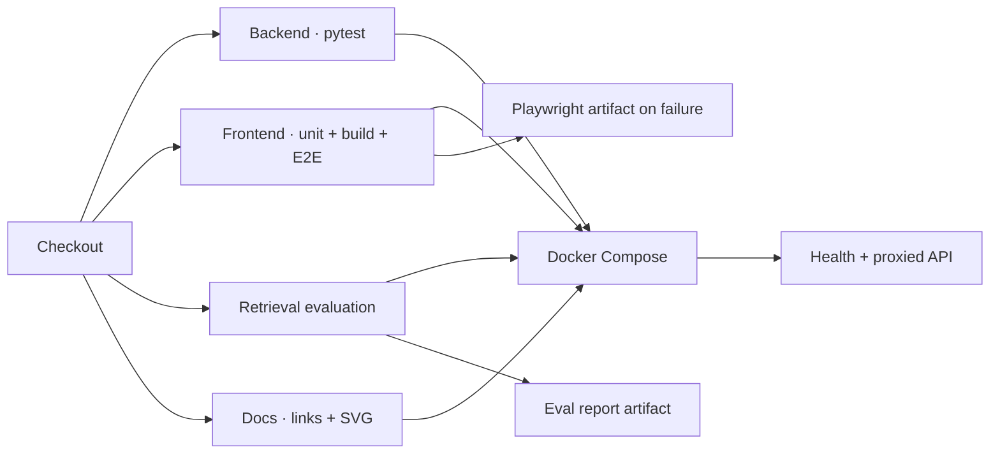

# 测试与评测

这个项目把“代码正确”和“检索质量没有退化”分开验证。单元测试能发现函数错误，但不能证明正确资料仍排在前面；黄金集能发现排序退化，但不能代替上传安全和 UI 状态测试。


## 测试金字塔

| 层级 | 工具 | 当前覆盖 | 主要失败信号 |
| --- | --- | --- | --- |
| 文档质量 | Python stdlib checker | Markdown + SVG + PNG/JPEG 清单 | 失效链接、空 alt、无障碍元数据、伪格式或预览规格 |
| 后端单元/接口 | pytest | 73 tests | legacy migration、KB、jobs、DOCX、SSE、多轮、provider、拒答与恢复 |
| 前端单元/组件 | Vitest + Testing Library | 13 tests | SSE、KB/jobs、API 超时、参数校验、Trace 和工作台交互 |
| Demo smoke | pytest | 1 workflow | 导入 → 提问 → 引用的真实内存链路 |
| 浏览器关键路径 | Playwright Chromium | 6 tests | 上传、URL、问答、引用、拒答、KB、任务重试、移动端 |
| 检索回归 | 固定 JSONL + Python runner | 40 cases | Recall@5、MRR、引用、拒答、回答接受阈值 |
| 容器集成 | Docker Compose + curl | 2 services | 构建、健康等待和前端代理 |

统计数字是当前基线，不是永久承诺；新增行为时应优先增加覆盖，而不是维持某个测试数量。

## 本地命令

```bash
npm test                 # pytest + Vitest
npm run lint:docs        # 链接、alt、SVG 元数据、图片格式/清单与 social preview
npm run lint:secrets     # 跟踪/待提交文本中的高置信度凭据模式
npm run build            # TypeScript check + Vite production build
npm run test:demo        # 离线 API smoke
npm run eval:retrieval   # 固定黄金集与阈值
npm run test:e2e         # Playwright 桌面与移动项目
npm run verify           # 以上全部
```

测试命令显式设置：

```text
EMBEDDING_PROVIDER=mock
VECTOR_STORE=memory
ANSWER_PROVIDER=template
QUERY_REWRITE_PROVIDER=none
OPENAI_API_KEY=
ANSWER_API_KEY=
QUERY_REWRITE_API_KEY=
```

因此即使开发机 `.env` 配置了真实 provider，验收也不会意外调用付费 API。

## 黄金集结构

`eval/cases.jsonl` 每行一个 JSON 对象：

```json
{
  "id": "technical-refusal",
  "category": "trust",
  "question": "证据不足时系统应该如何处理？",
  "should_answer": true,
  "expected_sources": ["02-rag-workbench-technical.md"],
  "expected_keywords": ["拒答", "资料缺口"]
}
```

拒答 case 使用 `"should_answer": false`，通常不设置期望来源。case 必须：

- 有唯一、稳定、可读的 `id`；
- 使用脱敏或公开资料；
- 问题措辞足够明确，避免多个同样合理的来源；
- 对可回答 case 指定至少一个期望来源；
- 只把真正决定相关性的词放入 `expected_keywords`；
- 说明产品期望，而不是迎合当前排序结果。

## 指标定义

设可回答 case 数量为 `N`：

### Recall@5

前五条 citation 中出现符合期望来源且命中至少一个期望关键词的 case 比例。

```text
Recall@5 = relevant source found in top 5 / N
```

它回答“目标资料有没有被召回”，不关心排第几。

### MRR

对每个可回答 case 取第一个相关 citation 的排名倒数，再求平均：

```text
MRR = mean(1 / first relevant rank)
```

第一条命中得 1，第二条得 0.5，完全未命中得 0。它比 Recall 更敏感于排序变化。

### 引用准确率

当前离线回归定义为：可回答 case 的第一条 citation 是否符合期望来源并命中关键词。它是首条证据正确率，不等同于回答所有主张的覆盖率；后者由运行时 `citation_audit` 单独给出。

### 拒答准确率

对 `should_answer=false` 的 case，系统是否返回拒答原因或零 citation。它防止通过降低门槛来虚假提高 Recall。

### Answer acceptance

可回答 case 是否没有被错误拒绝，便于区分“召回到了错误来源”和“门槛过高”；0.2 将它设为独立 CI 门。

## 当前门槛

`eval/thresholds.json`：

| 指标 | 最低值 |
| --- | ---: |
| Recall@5 | 0.90 |
| MRR | 0.75 |
| 首条引用准确率 | 0.75 |
| 拒答准确率 | 0.80 |
| 回答接受准确率 | 0.85 |

门槛不是漂亮数字展示。修改门槛必须在 PR 中解释：数据集如何变化、失败属于预期产品变化还是回归、为什么新阈值仍能阻止已知故障。


当前 case 构成、记录结果和解释限制见[固定黄金集评测结果](evaluation-results.md)。

## 报告

运行：

```bash
npm run eval:retrieval
```

输出：

```text
eval/reports/latest.md    # 人可读指标、case 表和需要处理列表
eval/reports/latest.json  # 机器可读 summary、checks 与 rows
```

报告会写入 latest 快照，GitHub Actions 每次都上传 artifact。阈值失败时 runner 返回非零退出码并列出失败指标与 case；需要只记录新基线时可直接运行脚本的 `--no-fail`，但不能把它用于 CI 绕过门禁。

## 新增回归 case 的流程

1. 在 UI 对失败回答点踩并选择失败类型。
2. 从 `/api/eval/drafts` 查看草稿。
3. 人工核对原始资料、期望回答和隐私内容。
4. 把稳定 case 加到 `eval/cases.jsonl`。
5. 先运行旧代码确认 case 能暴露问题。
6. 实现修复并运行 `npm run verify`。
7. 在 PR 说明指标变化和失败机制。

## 失败时如何诊断

| 失败指标 | 优先检查 | 不推荐的第一反应 |
| --- | --- | --- |
| Recall@5 | 文档是否索引、分支候选、candidate K | 立即降低阈值 |
| MRR | 融合权重、MMR、rerank | 无限增大 top K |
| 引用准确率 | 第一条来源、chunk 切分、引用映射 | 只修改答案文案 |
| 拒答准确率 | generic-only gate、min score、负样本 | 关闭拒答门 |
| E2E | network mock 匹配、状态与可访问名称 | 增加任意 sleep |
| Docker | healthcheck、Nginx proxy、挂载 | 取消健康依赖 |

检索阶段的详细因果顺序见[检索与可信回答](retrieval-explained.md)。

## CI 执行图



所有 job 都使用离线 provider；远端 CI 与本地 `npm run verify` 共同构成发布前证据，但仍不能替代真实部署环境的备份、容量和故障注入测试。
